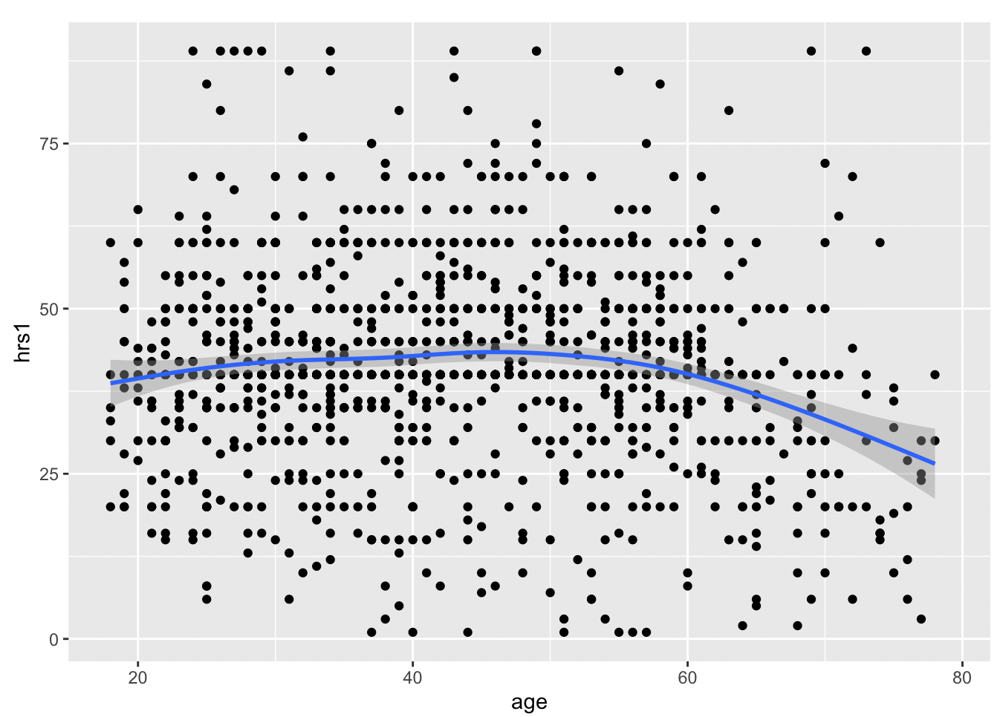

# Intro to R

*This section is drafted based on Dr. Mark Hoffman's previous SOC 10 lab notes.*

## R Basics

This initial tutorial for R has two primary learning objectives. The first is to become affiliated with the R environment and the second is to learn how to extend the basic set of R functions to make it suitable for your own research purposes.

The lessons we learn in this tutorial will serve as a strong basis for the those that follow, which focus on the actual analysis of data using R.

Like most programming languages, R can serve as a calculator. We will use many of these basic mathematical operations when working with data. 

Let's start with the basics:

```r
2 + 2
return: [1] 4
```
```r
3*(2+2) 
return: [1] 12
```
We use the assignment operator “<-” to save the results in a vector for later.
```r
four <- 2+2
sixteen <- (2+2)^2
```
If we type the name of the vector, it will return its values.
```r
four
return: [1] 4
```
Functions in R also have names. Functions save lines of codes! 

Later on, we will learn to write our own functions. For now, we can make use of the large body of default functions that exist within R.

The most basic function is print. We can use it to output text in the console.
```r
print("Hello world!")
return: [1] "Hello world!"
```
log() is another useful function and it has two arguments, x and base. When you call the function log() you have to specify x (the input value), while base has a default of exp(1).
```r
log82 <- log(x = 8, base = 2)
```
If you don’t specify the arguments in their correct order, you must use argument=value form or else you will get a different result.
```r
log1 <- log(8, base = 2)
log2 <- log(x = 8, base = 2)
log3 <- log(8, 2)
log4 <- log(base = 2, x = 8)
log5 <- log(2, 8)
```

The cat function concatenates the R objects and prints them.
```r
cat(log1, log2, log3, log4, log5)
return: 3 3 3 3 0.3333333
```

## Vectors
Vectors are the most basic object in R. They contain ordered elements of the same type. Vectors of size > 1 are created using the “c” function.
```r
v <- c(0,1,2,3,4,5,6,7,8,9)
print(v)
return: [1] 0 1 2 3 4 5 6 7 8 9
```
Computations on vectors are performed element-wise.
```r
v <- v * 3
print(v)
return: [1]  0  3  6  9 12 15 18 21 24 27
```
When we are working with a vector, we might to see what the fourth or fifth element is. We can use indexing to identify them. Indexing looks like this:
```r
v[4]
return: [1] 9
v[5]
return: [1] 12
```
Finally, we may wish to remove elements from a vector. We can use the subset function to do this.

## Loading Packages
Before we move on to datasets, rather than just vectors, let’s install some necessary packages. Packages are collections of R functions, data, and compiled code. They are built by members of the R community to add functionality to base R. Generally, if you wish you could do something with R, someone has built a package to do it already!

We will use a few packages, some of which are built into R. We will need to install the others. For now, we just need to install tidyverse, which is the most complete data analysis and visualization package for R. To do so, we use the install.packages() function.
```r
# install.packages("tidyverse")
```
The library function tells R to add the contents of the package to the current R session so that we can use it in our analyses.
```r
library(tidyverse)
```
We will use the library() function every time we start a new R session. If R cannot find a function that you are sure is in a package you use, it normally means the package isn’t loaded or that you somehow misspelled the function name.

## Exploring and Visualizing Data

Now, let’s actually get our hands dirty and start analyzing data. The first thing we will need to do is to pick a data set to analyze. A good candidate is the General Social Survey (GSS) - a large-scale survey that sociologists have been administering since the 1960s, meant to gauge the changing social attitudes and practices of Americans over time. It is probably sociology’s most celebrated dataset, the subject of tens of thousands of papers since its inception. It isn’t quite big data (only a couple thousand respondets each year), but it is a good starting point for our first data exercises.

To download the GSS, first navigate to: https://gss.norc.org/get-the-data/stata

Then, click where it says 2018, under the heading Download Individual Year Data Sets (cross-section only).

For now, drag the downloaded file to your Desktop. It is a STATA file, so we will have to use a special R package, foreign, to load it into R as well as the function, read.dta, from that package.

A function is basically a command which helps you do something. Later on, we will work on writing our own functions, for now we will us the functions that other people’s packages supply for us.
```r
# load in the foreign package.. it comes with R
library(foreign)
# now we can load in the GSS data
gss <- read.dta("Data/GSS2018.dta")
```
You can use the View() or head() functions to actually view the data and see what it looks like.
```r
##   abany abdefect   abfelegl abhelp1 abhelp2 abhelp3 abhelp4 abhlth
## 1    no      yes       <NA>     yes     yes     yes     yes    yes
## 2   yes      yes it depends      no      no      no      no    yes
## 3  <NA>     <NA>       <NA>     yes      no     yes     yes   <NA>
## 4  <NA>     <NA>     should     yes     yes     yes     yes   <NA>
## 5    no      yes       <NA>      no      no      no     yes    yes
## 6   yes      yes     should     yes     yes     yes     yes    yes
##                    abinspay                                          abmedgov1
## 1     people should be able                       the government should decide
## 2 people should not be able                                               <NA>
## 3 people should not be able a woman and her medical professional should decide
## 4     people should be able                                               <NA>
## 5 people should not be able                                               <NA>
## 6     people should be able                                               <NA>
```
If you have ever worked with Excel before, this should look pretty familiar! In R, this is called a data.frame(). It is the most common way we will use to organize data.
```r
class(gss)
```
```r
return: [1] "data.frame"
```
A data.frame is organized into rows and columns. Each row holds the data for a single respondent, whereas each column holds the data for a single variable (or question). Let’s see how many people (rows) and variables (columns) the data have.
```r
# Check the number of rows
nrow(gss)
```
```r
return: [1] 2348
```
```r
# Check the number of columns
ncol(gss)
```
```r
return: [1] 1064
```
```r
# Or both at the same time!
dim(gss)
```
```r
return: [1] 2348 1064
```
We can find this information over in the environment too.

The rows are numbered, while the columns have names. But if you look at the column names, they won’t make much sense.
```r
# check the column names
colnames(gss)
```
```r
##    [1] "abany"         "abdefect"      "abfelegl"      "abhelp1"      
##    [5] "abhelp2"       "abhelp3"       "abhelp4"       "abhlth"       
##    [9] "abinspay"      "abmedgov1"     "abmedgov2"     "abmelegl"     
##   [13] "abmoral"       "abnomore"      "abpoor"        "abpoorw"      
##   [17] "abrape"        "absingle"      "abstate1"      "abstate2"     
##   [21] "acqntsex"      "actssoc"       "adults"        "advfront"     
##   [25] "affrmact"      "afraidof"      "afterlif"      "age"          
##   [29] "aged"          "agekdbrn"      "ancestrs"      "arthrtis"     
##   [33] "astrolgy"      "astrosci"      "atheists"      "attend"       
##   [37] "attend12"      "attendma"      "attendpa"      "away1"        
##   [41] "away11"        "away2"         "away3"         "away4"        
##   [45] "away5"         "away6"         "away7"         "babies"       
##   [49] "backpain"      "ballot"        "balneg"        "balpos"       
##   [53] "befair"        "betrlang"      "bible"         "bigbang"      
##   [57] "bigbang1"      "bigbang2"      "bird"          "birdb4"       
##   [61] "born"          "boyorgrl"      "breakdwn"      "buddhsts"     
##   [65] "buyesop"       "buyvalue"      "cantrust"      "cappun"       
##   [69] "cat"           "catb4"         "charactr"      "chemgen"      
##   [73] "childs"        "chldidel"      "christns"      "churhpow"     
##   [77] "class"         "clergvte"      "closeto1"      "closeto2"     
##   [81] "closeto3"      "closeto4"      "closeto5"      "cntctfam"     
##   [85] "cntctfrd"      "cntctkid"      "cntctpar"      "cntctsib"     
##   [89] "codeg"         "coden"         "coeduc"        "coevwork"     
##   [93] "cofund"        "cohort"        "cohrs1"        "cohrs2"       
##   [97] "coind10"       "coisco08"      "cojew"         "colath"       
##  [101] "colcom"        "coldeg1"       "colhomo"       "colmil"       
##  [105] "colmslm"       "colrac"        "colsci"        "colscinm"     
##  [109] "comfort"       "company"       "compperf"      "comprend"     
##  [113] "compuse"       "compwage"      "conarmy"       "conbiz"       
##  [117] "conbus"        "conchurh"      "conclerg"      "concong"      
##  [121] "concourt"      "condemnd"      "condom"        "condrift"     
##  [125] "coneduc"       "conf2f"        "confed"        "confinan"     
##  [129] "coninc"        "conjudge"      "conlabor"      "conlegis"     
##  [133] "conmedic"      "conpress"      "conrinc"       "conschls"     
##  [137] "consci"        "consent"       "contv"         "conwkday"     
##  [141] "coocc10"       "coop"          "coother"       "copres10"     
##  [145] "copres105plus" "corel"         "cosei10"       "cosei10educ"  
##  [149] "cosei10inc"    "courts"        "cowrkhlp"      "cowrkint"     
##  [153] "cowrkslf"      "cowrksta"      "crack30"       "dangoth1"     
##  [157] "dangoth2"      "dangoth3"      "dangoth4"      "dangoth5"     
##  [161] "dangroth"      "dangrslf"      "dangslf1"      "dangslf2"     
##  [165] "dangslf3"      "dangslf4"      "dangslf5"      "dateintv"     
##  [169] "decmoney"      "dectreat"      "defpensn"      "degree"       
##  [173] "demands"       "denkid"        "denom"         "denom16"      
##  [177] "depress"       "deptperf"      "diabetes"      "diagnosd"     
##  [181] "difrel"        "dinefrds"      "dipged"        "discaff"      
##  [185] "discaffm"      "discaffw"      "disrspct"      "divlaw"       
##  [189] "divorce"       "dofirst"       "dog"           "dogb4"        
##  [193] "dwelling"      "dwellpre"      "dwelown"       "dwelown16"    
##  [197] "earnrs"        "earthsun"      "educ"          "egomeans"     
##  [201] "electron"      "emailhr"       "emailmin"      "emoprobs"     
##  [205] "empinput"      "emptrain"      "endsmeet"      "eqwlth"       
##  [209] "esop"          "esopnot"       "eth1"          "eth2"         
##  [213] "eth3"          "ethnic"        "ethnum"        "evcrack"      
##  [217] "evidu"         "evolved"       "evolved2"      "evpaidsx"     
##  [221] "evstray"       "evwork"        "expdesgn"      "exptext"      
##  [225] "extr2017"      "extrapay"      "extraval"      "extrayr"      
##  [229] "fair"          "fairearn"      "famdif16"      "famgen"       
##  [233] "family16"      "fammhneg"      "fampress"      "famvswk"      
##  [237] "famwkoff"      "fatalism"      "fatigue"       "fear"         
##  [241] "fechld"        "feelevel"      "feelrel"       "feeused"      
##  [245] "fefam"         "fehire"        "fejobaff"      "fepol"        
##  [249] "fepresch"      "finalter"      "finrela"       "firstyou"     
##  [253] "fish"          "fishb4"        "form"          "formwt"       
##  [257] "fringeok"      "frndsex"       "fucitzn"       "fund"         
##  [261] "fund16"        "gender1"       "gender10"      "gender11"     
##  [265] "gender12"      "gender2"       "gender3"       "gender4"      
##  [269] "gender5"       "gender6"       "gender7"       "gender8"      
##  [273] "gender9"       "geneabrt2"     "genegen"       "genegoo2"     
##  [277] "geneself2"     "genetics"      "genetst1"      "getahead"     
##  [281] "goat"          "goatb4"        "god"           "godchnge"     
##  [285] "godmeans"      "godswill"      "goodlife"      "goveqinc"     
##  [289] "govlazy"       "govvsrel"      "granborn"      "grass"        
##  [293] "gunlaw"        "handmove"      "hapcohab"      "hapmar"       
##  [297] "happy"         "hapunhap"      "haveinfo"      "health"       
##  [301] "health1"       "healthissp"    "heaven"        "hefinfo"      
##  [305] "height"        "hell"          "helpblk"       "helpfrds"     
##  [309] "helpful"       "helpnot"       "helpoth"       "helppoor"     
##  [313] "helpsick"      "hhrace"        "hhtype"        "hhtype1"      
##  [317] "hindus"        "hispanic"      "hivtest"       "hivtest1"     
##  [321] "hivtest2"      "hlpadvce"      "hlpdown"       "hlpequip"     
##  [325] "hlphome"       "hlpjob"        "hlploan"       "hlppaper"     
##  [329] "hlpresde"      "hlpsick"       "hlpsickr"      "hlpsococ"     
##  [333] "hlthdays"      "hlthmntl"      "hlthphys"      "hlthstrt"     
##  [337] "homosex"       "homosex1"      "hompop"        "horse"        
##  [341] "horseb4"       "hotcore"       "hrs1"          "hrs2"         
##  [345] "hrsrelax"      "hsbio"         "hschem"        "hsmath"       
##  [349] "hsphys"        "huadd"         "huaddwhy"      "hubbywrk"     
##  [353] "huclean"       "hunt"          "hunt1"         "hurtatwk"     
##  [357] "hurtoth"       "hurtself"      "hvylift"       "hyperten"     
##  [361] "id"            "idu30"         "if12who"       "if16who"      
##  [365] "imbalnce"      "imprvown"      "imprvtrt"      "incgap"       
##  [369] "incom16"       "income"        "income16"      "incuspop"     
##  [373] "indperf"       "indus10"       "indusgen"      "intage"       
##  [377] "intcntct"      "intecon"       "inteduc"       "intenvir"     
##  [381] "intethn"       "intfarm"       "inthisp"       "intid"        
##  [385] "intintl"       "intlblks"      "intlhsps"      "intlwhts"     
##  [389] "intmed"        "intmil"        "intrace1"      "intrace2"     
##  [393] "intrace3"      "intsci"        "intsex"        "intspace"     
##  [397] "inttech"       "intyrs"        "isco08"        "isco88"       
##  [401] "issp"          "jew"           "jew16"         "jews"         
##  [405] "jobfind"       "jobfind1"      "joblose"       "jobsecok"     
##  [409] "kidpars"       "kidsinhh"      "kidssol"       "knowschd"     
##  [413] "knowwhat"      "knwbus"        "knwclenr"      "knwcop"       
##  [417] "knwcuttr"      "knwexec"       "knwhrman"      "knwlawyr"     
##  [421] "knwmchnc"      "knwmw1"        "knwmw2"        "knwmw3"       
##  [425] "knwmw4"        "knwmw5"        "knwnurse"      "knwtcher"     
##  [429] "laidoff"       "lasers"        "learnnew"      "letdie1"      
##  [433] "letin1a"       "libath"        "libcom"        "libhomo"      
##  [437] "libmil"        "libmslm"       "librac"        "life"         
##  [441] "lifein5"       "lifenow"       "liveblks"      "lngthinv"     
##  [445] "localnum"      "lonely1"       "lonely2"       "lonely3"      
##  [449] "madeg"         "madenkid"      "maeduc"        "maind10"      
##  [453] "maisco08"      "maisco88"      "major1"        "major2"       
##  [457] "majorcol"      "makefrnd"      "maleornt"      "manvsemp"     
##  [461] "maocc10"       "mapres10"      "mapres105plus" "mar1"         
##  [465] "mar11"         "mar12"         "mar2"          "mar3"         
##  [469] "mar4"          "mar5"          "mar6"          "mar7"         
##  [473] "mar8"          "mar9"          "marasian"      "marblk"       
##  [477] "marcohab"      "marelkid"      "marhisp"       "marhomo"      
##  [481] "marital"       "martype"       "marwht"        "masei10"      
##  [485] "masei10educ"   "masei10inc"    "matesex"       "mawrkgrw"     
##  [489] "mawrkslf"      "mcsds1"        "mcsds2"        "mcsds3"       
##  [493] "mcsds4"        "mcsds5"        "mcsds6"        "mcsds7"       
##  [497] "meddoc"        "mentldoc"      "mentlhos"      "mentlill"     
##  [501] "mentloth"      "meovrwrk"      "mhdiagno"      "mhp1r1"       
##  [505] "mhp1r2"        "mhp2r1"        "mhp2r2"        "mhp3r1"       
##  [509] "mhp3r2"        "mhp4r1"        "mhp4r2"        "mhp5r1"       
##  [513] "mhp5r2"        "mhtreat1"      "mhtreat2"      "mhtreat3"     
##  [517] "mhtreat4"      "mhtreat5"      "mhtreatd"      "mhunsure"     
##  [521] "miracles"      "misswork"      "mnthsusa"      "mntlhlth"     
##  [525] "mobile16"      "mode"          "moredays"      "muslims"      
##  [529] "mustdoc"       "musthosp"      "mustmed"       "mustwork"     
##  [533] "mygoals"       "myprobs1"      "myprobs2"      "myprobs3"     
##  [537] "myprobs4"      "myprobs5"      "myskills"      "mywaygod"     
##  [541] "nanoben"       "nanoharm"      "nanowill"      "nataccess"    
##  [545] "natactive"     "nataid"        "nataidy"       "natarms"      
##  [549] "natarmsy"      "natchld"       "natcity"       "natcityy"     
##  [553] "natcrime"      "natcrimy"      "natdrug"       "natdrugy"     
##  [557] "nateduc"       "nateducy"      "natenrgy"      "natenvir"     
##  [561] "natenviy"      "natfare"       "natfarey"      "natheal"      
##  [565] "nathealy"      "natlack"       "natmass"       "natmeet"      
##  [569] "natnotice"     "natpark"       "natrace"       "natracey"     
##  [573] "natrelax"      "natroad"       "natsat"        "natsci"       
##  [577] "natsoc"        "natspac"       "natspacy"      "nattime"      
##  [581] "nattimeok"     "natviews"      "neisafe"       "newfrds"      
##  [585] "news"          "newsfrom"      "nextgen"       "nihilism"     
##  [589] "notsmart"      "ntwkhard"      "nukegen"       "numcong"      
##  [593] "numemps"       "numlangs"      "nummen"        "numorg"       
##  [597] "numpets"       "numwomen"      "obey"          "occ10"        
##  [601] "odds1"         "odds2"         "old1"          "old10"        
##  [605] "old11"         "old12"         "old2"          "old3"         
##  [609] "old4"          "old5"          "old6"          "old7"         
##  [613] "old8"          "old9"          "opdevel"       "otcmed"       
##  [617] "oth16"         "other"         "othersex"      "othlang"      
##  [621] "othlang1"      "othlang2"      "othmhneg"      "othpet"       
##  [625] "othpetb4"      "oversamp"      "overwork"      "owngun"       
##  [629] "ownstock"      "padeg"         "padenkid"      "paeduc"       
##  [633] "paidsex"       "painarms"      "paind10"       "paisco08"     
##  [637] "paisco88"      "paocc10"       "papres10"      "papres105plus"
##  [641] "parborn"       "parelkid"      "parsol"        "partfull"     
##  [645] "partlsc"       "partners"      "partnrs5"      "partpart"     
##  [649] "partteam"      "partvol"       "partyid"       "pasei10"      
##  [653] "pasei10educ"   "pasei10inc"    "pawrkslf"      "petb4"        
##  [657] "petb4cmfrt"    "petb4fam"      "petb4ply"      "petcmfrt"     
##  [661] "petfam"        "petplay"       "phase"         "phone"        
##  [665] "phyeffrt"      "physacts"      "physhlth"      "physill"      
##  [669] "pig"           "pigb4"         "pikupsex"      "pilingup"     
##  [673] "pillok"        "pistol"        "polabuse"      "polattak"     
##  [677] "poleff11"      "polescap"      "polhitok"      "polmurdr"     
##  [681] "polviews"      "poorserv"      "popespks"      "popular"      
##  [685] "pornlaw"       "posslq"        "posslqy"       "postlife"     
##  [689] "pray"          "prayer"        "prayfreq"      "premarsx"     
##  [693] "pres12"        "pres16"        "prestg10"      "prestg105plus"
##  [697] "preteen"       "prodctiv"      "promtefr"      "promteok"     
##  [701] "proudemp"      "prvdhlth"      "prvdold"       "quallife"     
##  [705] "racdif1"       "racdif2"       "racdif3"       "racdif4"      
##  [709] "race"          "racecen1"      "racecen2"      "racecen3"     
##  [713] "raclive"       "racopen"       "racwork"       "radioact"     
##  [717] "random"        "rank"          "ratepain"      "ratetone"     
##  [721] "realinc"       "realrinc"      "reborn"        "reg16"        
##  [725] "region"        "relactiv"      "relate1"       "relate10"     
##  [729] "relate11"      "relate12"      "relate2"       "relate3"      
##  [733] "relate4"       "relate5"       "relate6"       "relate7"      
##  [737] "relate8"       "relate9"       "relatsex"      "relext1"      
##  [741] "relext3"       "relgenbar"     "relgeneq"      "relhh1"       
##  [745] "relhh10"       "relhh11"       "relhh12"       "relhh2"       
##  [749] "relhh3"        "relhh4"        "relhh5"        "relhh6"       
##  [753] "relhh7"        "relhh8"        "relhh9"        "relhhd1"      
##  [757] "relhhd10"      "relhhd11"      "relhhd12"      "relhhd2"      
##  [761] "relhhd3"       "relhhd4"       "relhhd5"       "relhhd6"      
##  [765] "relhhd7"       "relhhd8"       "relhhd9"       "relig"        
##  [769] "relig16"       "religcon"      "religint"      "religkid"     
##  [773] "reliten"       "relmarry"      "relobjct"      "relpast"      
##  [777] "relpersn"      "relrlvnt"      "relscrpt"      "relsp1"       
##  [781] "relsp10"       "relsp11"       "relsp12"       "relsp2"       
##  [785] "relsp3"        "relsp4"        "relsp5"        "relsp6"       
##  [789] "relsp7"        "relsp8"        "relsp9"        "relsprt"      
##  [793] "reptile"       "reptileb4"     "res16"         "respect"      
##  [797] "respnum"       "respond"       "rfamlook"      "rgroomed"     
##  [801] "rhlthend"      "richwork"      "rifle"         "rincblls"     
##  [805] "rincom16"      "rincome"       "rlooks"        "rowngun"      
##  [809] "rplace"        "rvisitor"      "rweight"       "rxmed"        
##  [813] "safefrst"      "safehlth"      "safetywk"      "sampcode"     
##  [817] "sample"        "satfam7"       "satfin"        "satjob"       
##  [821] "satjob1"       "satlife"       "satsoc"        "savesoul"     
##  [825] "scibnfts"      "scientbe"      "scientgo"      "scienthe"     
##  [829] "scientod"      "scifrom"       "scinews1"      "scinews2"     
##  [833] "scinews3"      "scistudy"      "scitext"       "secondwk"     
##  [837] "seeksci"       "seetalk1"      "seetalk2"      "seetalk3"     
##  [841] "seetalk4"      "seetalk5"      "sei10"         "sei10educ"    
##  [845] "sei10inc"      "selfhelp"      "seriousp"      "severe1"      
##  [849] "severe2"       "severe3"       "severe4"       "severe5"      
##  [853] "sex"           "sexbirth"      "sexeduc"       "sexfreq"      
##  [857] "sexnow"        "sexornt"       "sexsex"        "sexsex5"      
##  [861] "shotgun"       "sibs"          "size"          "slfmangd"     
##  [865] "slpprblm"      "smallgap"      "smammal"       "smammalb4"    
##  [869] "socbar"        "socfrend"      "socommun"      "socrel"       
##  [873] "solarrev"      "spaneng"       "spanint"       "spanking"     
##  [877] "spanself"      "spdeg"         "spden"         "speduc"       
##  [881] "spevwork"      "spfalook"      "spfund"        "sphealer"     
##  [885] "sphrs1"        "sphrs2"        "spind10"       "spisco08"     
##  [889] "spisco88"      "spjew"         "spkath"        "spkcom"       
##  [893] "spkhomo"       "spklang"       "spkmil"        "spkmslm"      
##  [897] "spkrac"        "splive"        "spocc10"       "spother"      
##  [901] "sppres10"      "sppres105plus" "sprel"         "sprtprsn"     
##  [905] "spsei10"       "spsei10educ"   "spsei10inc"    "spvtrfair"    
##  [909] "spwksup"       "spwrkslf"      "spwrksta"      "srcbelt"      
##  [913] "stockops"      "stockval"      "stress"        "stress12"     
##  [917] "stresses"      "strredpg"      "suicide1"      "suicide2"     
##  [921] "suicide3"      "suicide4"      "supcares"      "supervis"     
##  [925] "suphelp"       "tax"           "teamsafe"      "teens"        
##  [929] "teensex"       "tempgen"       "theism"        "thnkself"     
##  [933] "threaten"      "tlkclrgy"      "tlkfam"        "toofast"      
##  [937] "toofewwk"      "trbigbus"      "trcourts"      "trdunion"     
##  [941] "trust"         "trustman"      "trustsci"      "trynewjb"     
##  [945] "tvhours"       "unemp"         "unhappy"       "union"        
##  [949] "union1"        "unrelat"       "upsdowns"      "upset"        
##  [953] "uscitzn"       "usedup"        "usetech"       "usewww"       
##  [957] "uswary"        "version"       "vetyears"      "vigfrnd"      
##  [961] "viggrp"        "viglabel"      "vigmar"        "vignei"       
##  [965] "vigsoc"        "vigversn"      "vigwork"       "viruses"      
##  [969] "visitors"      "visnhist"      "vissci"        "vistholy"     
##  [973] "viszoo"        "vote12"        "vote16"        "vpsu"         
##  [977] "vstrat"        "watergen"      "waypaid"       "wayraise"     
##  [981] "wealth"        "webmob"        "weekswrk"      "weight"       
##  [985] "where1"        "where11"       "where2"        "where3"       
##  [989] "where4"        "where5"        "where6"        "where7"       
##  [993] "whoelse1"      "whoelse2"      "whoelse3"      "whoelse4"     
##  [997] "whoelse5"      "whoelse6"      "whynopet"      "whywkhme"     
## [1001] "widowed"       "wkageism"      "wkdecide"      "wkfreedm"     
## [1005] "wkharoth"      "wkharsex"      "wkpraise"      "wkracism"     
## [1009] "wksexism"      "wksmooth"      "wksub"         "wksub1"       
## [1013] "wksubs"        "wksubs1"       "wksup"         "wksup1"       
## [1017] "wksups"        "wksups1"       "wkvsfam"       "wlthblks"     
## [1021] "wlthhsps"      "wlthwhts"      "worda"         "wordb"        
## [1025] "wordc"         "wordd"         "worde"         "wordf"        
## [1029] "wordg"         "wordh"         "wordi"         "wordj"        
## [1033] "wordsum"       "workblks"      "workdiff"      "workfast"     
## [1037] "workfor1"      "workhard"      "workhsps"      "workwhts"     
## [1041] "wrkgovt"       "wrkhome"       "wrksched"      "wrkslf"       
## [1045] "wrkslffam"     "wrkstat"       "wrktime"       "wrktype"      
## [1049] "wrkwayup"      "wtss"          "wtssall"       "wtssnr"       
## [1053] "wwwhr"         "wwwmin"        "xmarsex"       "xmarsex1"     
## [1057] "xmovie"        "xnorcsiz"      "year"          "yearsjob"     
## [1061] "yearsusa"      "yearval"       "yousup"        "zodiac"
```
They are like a secret code - if you know what the code means then you can figure out what information a variable holds. But how do we figure that out? We have to use a codebook!

Head over to https://gssdataexplorer.norc.org/variables/vfilter for an accessible online codebook. You can search for keywords to see if it has variables that you care about. Here are some random suggestions: * age * income * partyid * sex * race * hrs1

We can evaluate these variables more closely using various R functions. For example, what are respondents’ average age? We use the mean function for that, and specify the na.rm = T option to tell R that respodent’s who didn’t report an age should be ignored.
```r
mean(gss$age, na.rm = T)
```
```r
return: [1] 48.97138
```
Interesting - almost 50 years old! By comparison, the average age in the US is roughly 38 years old. This might signal that the GSS is skewed towards older respondents, but we have to remember that babies do not take surveys.

We can use the summary function to get a host of information about a variable’s distribution. For example, below we apply it to partyid - a measure of political affiliation which goes from 1 (Strong Demcorat) to 7 (Strong Republican) [the reason that it is different in practice than what the codebook says is because of how R converts factors to numerics, which we have to do to examine the scale quantitatively – specifically, the first option of a factor in R will be a 1 rather than a 0]. The median is a 4, which is dabsmack in the middle of the scale. The median respondent is an independent with no reported party leanings.
```r
summary(as.numeric(gss$partyid), na.rm = T)
```
```r
##    Min. 1st Qu.  Median    Mean 3rd Qu.    Max.    NA's 
##   1.000   2.000   4.000   3.883   6.000   8.000      33
```
Cool! What if we wanted to see how two variables relate to one another? For example, we have heard from pundits that racial background strongly shapes political leaning in the today’s America – does the GSS confirm that conclusion? For comparison, we can also look at how people of varioius racial backgrounds differ by age.

To achieve this, we first have to group the data by race using the group_by function from tidyverse.
```r
gss <- gss %>% group_by(race)
```
Now that respondents are grouped by race, we can use the summarize function to evaluate each group’s average party identification and age.
```r
vars_by_race <- gss %>% summarise(
                        partyid = mean(as.numeric(partyid), na.rm = T),
                        age = mean(age, na.rm = T)
                        )

vars_by_race
```
```r
## # A tibble: 3 × 3
##   race  partyid   age
##   <fct>   <dbl> <dbl>
## 1 white    4.25  50.5
## 2 black    2.45  46.0
## 3 other    3.61  43.3
```
With respect to politics - just as we expected! People who identify as white also tend to be a bit older on average than people who identify as black.

Instead of just looking at the averages, we could visualize them using a simple barplot.

We will use the ggplot function for this, which is one of the most useful suite of functions for visualization in all of R.
```r
ggplot(vars_by_race, aes(x=race, y=partyid, fill=race)) +
  geom_bar(stat="identity")
```


It is a complex function, so let’s break it down. The first argument is the data we want to visualize itself - vars_by_race.

Then we need to establish the aesthetics (i.e. aes()).

x is the x variable (i.e. the variable on the x-axis of the graph), y is the y variable (i.e. the varible on the y axis of the graph), and fill is the variable we want to use to color the bars (race).

Now that the aesthetics are established, we tell ggplot what kind of plot we want (geom_bar specifies a bar plot). And stat = “identity” means we want to graph the values as they are in the data we provided, rather than trying to do something else with them.

Let me now use another example ("marital" variable, which represents marital status) to demonstrate how we can further beautify a bar plot. Specifically, I will show how to edit the labels on the X-axis. 
If we directly plot it using the following code, you will notice the x-axis labels are not readable in the sense we do not know what different numbers represent. 

```r
gss$marital <- as.character(gss$marital)
ggplot(gss, aes(x = marital)) + 
  geom_bar(fill = "blue",) + 
  labs(title = "Marital Status of Respondents", x = "Marital Status", y = "Frequency")
```


Alternatively, we can add a scale_x_discrete() option to manually label the different values:

```r
gss$marital <- as.character(gss$marital)
ggplot(gss, aes(x = marital)) + 
  geom_bar(fill = "blue",) + 
  scale_x_discrete(labels=c("1" = "Married", "2" = "Widowed","3" = "Divorced", "4" = "Separated", "5" = "Never married")) +
  labs(title = "Marital Status of Respondents", x = "Marital Status", y = "Frequency")
```


```r
gss$marital <- as.character(gss$marital)
ggplot(gss, aes(x = marital)) + 
  geom_bar(fill = "blue",) + 
  scale_x_discrete(labels=c("1" = "Married", "2" = "Widowed","3" = "Divorced", "4" = "Separated", "5" = "Never married")) +
  labs(title = "Marital Status of Respondents", x = "Marital Status", y = "Frequency")
```

Barplots are useful when you want to see the relationship between a continuous variable (like partyid) and a categorical variable (like race). But what if we have two continuous variables, like age and how many hours one works a week? We can use scatterplots for that!

First, let’s return the data to its original state by ungrouping it.
```r
gss <- gss %>% ungroup()
```
Now we can use geom_point, instead of bar, to plot the relationship between age and hours worked last week (hrs1).
```r
ggplot(data = gss, aes(x = age, y = hrs1)) + 
  geom_point()
```
```r
## Warning: Removed 973 rows containing missing values (geom_point).
```

With geom_smooth(), we can add a best fit line to better understand the relationship.
```r
ggplot(data = gss, aes(x = age, y = hrs1)) + 
  geom_point() +
  geom_smooth()
```

Pretty flat, with a bit of a decrease after age 50, and a weird uptick around 100 years old… perhaps that is just noise? Let’s filter out the really old people from the data. It is simple using the filter command. All we have to specify is that we want people of age less than 80, like so.
```r
gss_younger <- gss %>% filter(age < 80)
  geom_smooth()
```
Now we replot the data, except we have to change the name of the data we are using to gss_younger!
```r
ggplot(data = gss_younger, aes(x = age, y = hrs1)) + 
  geom_point() +
  geom_smooth()
```

We can add in another variable using color, if we want. Coloring by sex, for example, reveals remaining discrepencies in workforce participation between males and females, though there is a lot of overlap, and much more than we would have seen twenty years ago.
```r
ggplot(data = gss, aes(x = age, y = hrs1, color = sex)) + 
  geom_point()
```


