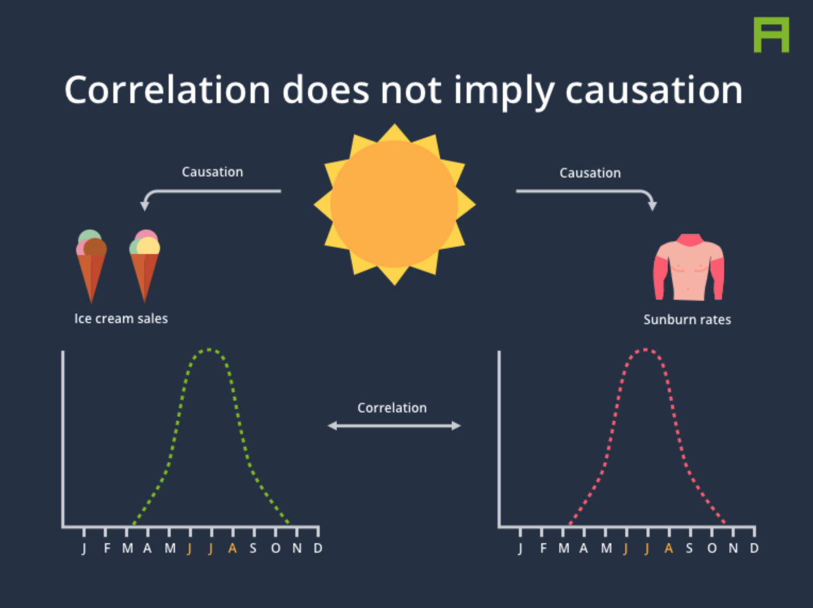
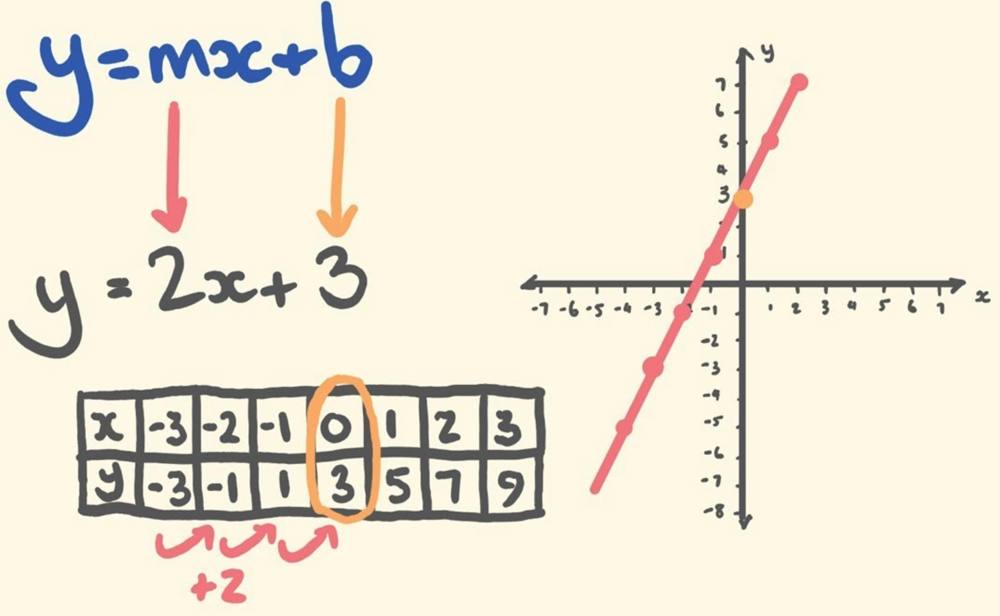
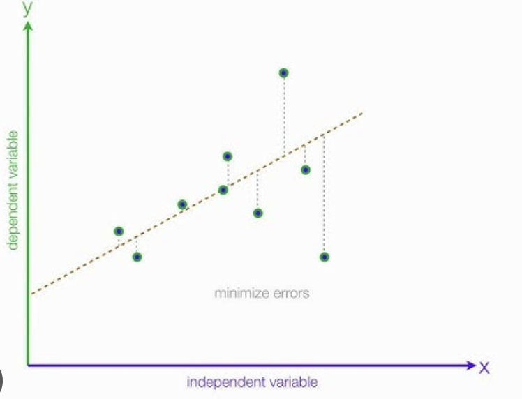
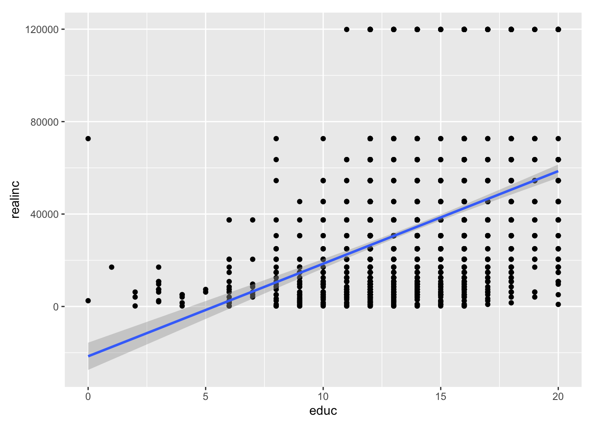
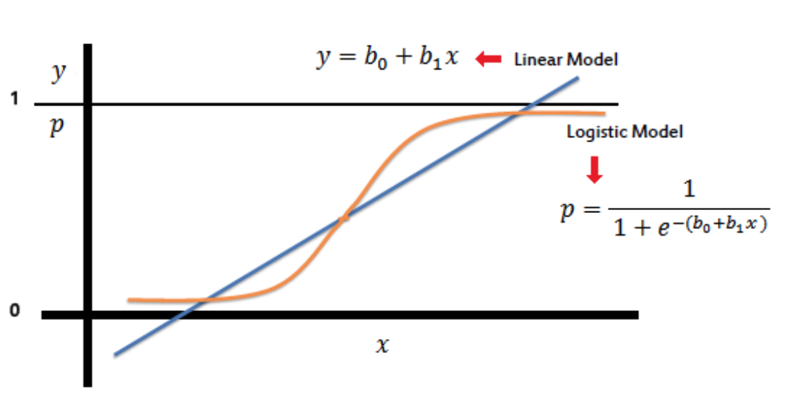

# Regression and Classification

*This section is drafted based on Dr. Mark Hoffman's previous SOC 10 lab notes and kassambara's tutorial on logistic regression with R on STHDA.*

This week’s lab introduces fundamental machine learning techniques widely used in computational social science to both model and analyze data. In contrast to traditional programming—where explicit instructions are provided at every step—machine learning equips computers with the ability to identify patterns and make decisions based on data. Generally, our objectives in machine learning are threefold: to describe and understand the data, to develop models that test theories about how the data is generated, and to make predictions that generalize to new, similar situations.

We begin by exploring Linear Regression, a popular method in the social sciences for modeling relationships between variables. Regression analysis allows us to quantify how changes in one or more predictor variables are associated with changes in a continuous outcome variable. This technique not only provides insights into the underlying patterns of the data but also is useful for predicting continuous outcomes (e.g., household income, movie box office).

In addition to regression, we will also cover Classification techniques, with a particular focus on Logistic Regression. Unlike regression, which deals with predicting continuous outcomes, classification methods are designed to predict categorical outcomes. For example, logistic regression models the probability of an observation belonging to a particular category—often a binary outcome—by leveraging a logistic function. The key difference between regression and classification lies in their goals: while regression estimates a numerical value, classification assigns an observation to a discrete class based on learned patterns in the data.

## Linear Regression 

In the previous two labs, we learned how to download data and visualize patterns between variables. In what follows, we will go beyond data visualization and begin to ask theoretically informed questions and using data, again, from the GSS, to answer those questions. Where before we plotted two variables against each other to see their relationship, linear regression will allow us to quantify their relationship: how much do changes in our explanatory variable lead to changes in the variable we are hoping to explain? Is this relationship statistically significant - that is, does it differ from what we should expect by chance?

Linear regression will also allow us to adjust for covariates - variables that may be affecting our primary dependent variable of interest as well as our independent variable. For example, in classic example of confounding, we may see that the number of ice cream cones people eat per year is correlated with the number of sunburns they get and think that ice cream causes sunburns. However, it is obvious that both of these factors will be influenced by how warm of a climate people live in - with people living in warmer climates consuming more ice cream AND getting more sunburns. By controlling for the warmth of the climate, we can adjust for this fact and likely any association we saw between ice cream and sunburns will go away.


*Figure Source: Parsa Ghaffari.*

## How linear regression works

You may remember the slope-intercept form of writing the equation of a straight line from algebra. 

$$
y = mx + b
$$

Here, we can calculate the coordinate y for any x by first multiplying x by the slope of the line, m, and adding the value of the intercept, b, which is where the line intersects with the y axis.


*Figure Source: tecmath.*

Linear regression is a strategy for finding the line that best fits the relationship between two variables (later on we can add more variables as control variables). We start with a y variable, also called the outcome or the dependent variable, and an x variable, also called a predictor or the independent variable, and ask what is the slope-intercept equation that most closely approximates their relationship. Given x and y, linear regression therefore involves estimating the slope, m, and intercept, b, of the line.

Rarely in real world applications are two variables perfectly related to one another: even the best social science models have error. To reflect this, we update the equation above to:

$$
y = mx + b + ε
$$
With ε capturing the error in our predictions.

How do we fit a line to x and y? The short of it is that we will start with line (say, a horizontal one) and keep adjusting the slope and intercept of that line to minimize the average distance between the data points and the line itself. Residuals are the difference between the observed values and the values predicted by the line:

$$
residual_i=y_i−\hat{y}_i
$$

Linear regression will seek to minimize the sum of the squared residuals, also known as the sum of squares:

$$
\text{SumSquares} = \sum_{i=1}^n \left(y_i - \hat{y}_i\right)^2
$$


*Figure Source: statisticsfun.*

## Linear regression using the lm function
Thankfully, as computational social scientists, we won’t have to do this adjustment by hand. The lm function in R uses an algorithm, called gradient descent, to find the linear regression line that best minimizes the sum of squares for us.

```r
m1 <- lm(realinc ~ age, data = gss)
```

The first argument in the function lm is a formula that takes the form y ~ x. Here it can be read that we want to make a linear model of real household income as a function of age The second argument specifies that R should look in the gss data frame to find the age and realinc variables.

The output of lm is an object that contains all of the information we need about the linear model that was just fit. We can access this information using the summary function.

```r
summary(m1)
```

```r
## 
## Call:
## lm(formula = realinc ~ age, data = gss)
## 
## Residuals:
##    Min     1Q Median     3Q    Max 
## -36142 -21953  -8800  11184  88412 
## 
## Coefficients:
##             Estimate Std. Error t value Pr(>|t|)    
## (Intercept) 30130.57    1968.22  15.309   <2e-16 ***
## age            74.27      37.87   1.961     0.05 *  
## ---
## Signif. codes:  0 '***' 0.001 '**' 0.01 '*' 0.05 '.' 0.1 ' ' 1
## 
## Residual standard error: 31160 on 2145 degrees of freedom
##   (201 observations deleted due to missingness)
## Multiple R-squared:  0.00179,    Adjusted R-squared:  0.001324 
## F-statistic: 3.846 on 1 and 2145 DF,  p-value: 0.04999
```

Let’s consider this output piece by piece. First, the formula used to describe the model is shown at the top. After the formula you find the five-number summary of the residuals. The “Coefficients” table shown next is key; its first column displays the linear model’s y-intercept and the coefficient of age. With this table, we can write down the least squares regression line for the linear model:

$$
\hat{y} =30130.57+74.27∗age
$$

It also shows whether the coefficients, here, age, have are statistically significant in predicting the outcome, income. Normally, a p-value cut-off of 0.05 is used to determine statistical significance - here, age’s p-value is almost exactly 0.05 (in fact, it is very slightly lower) and is therefore significant.

One last piece of information we will discuss from the summary output is the Multiple R-squared, or more simply, R2. The R2 value represents the proportion of variability in the response variable that is explained by the explanatory variable. For this model, only %.18 of the variability in income is explained by age.

What variables might do a better job of explaining income? Let’s try years of education, which is the variable educ in the gss. Using the estimates from the R output, write the equation of the regression line. What does the slope tell us in the context of the relationship between income and education

```r
m2 <- lm(realinc ~ educ, data = gss)
summary(m2)
```
```r
## 
## Call:
## lm(formula = realinc ~ educ, data = gss)
## 
## Residuals:
##    Min     1Q Median     3Q    Max 
## -57666 -18112  -6093  10864  97362 
## 
## Coefficients:
##             Estimate Std. Error t value Pr(>|t|)    
## (Intercept)   -21552       3006  -7.171 1.02e-12 ***
## educ            4006        213  18.809  < 2e-16 ***
## ---
## Signif. codes:  0 '***' 0.001 '**' 0.01 '*' 0.05 '.' 0.1 ' ' 1
## 
## Residual standard error: 28880 on 2149 degrees of freedom
##   (197 observations deleted due to missingness)
## Multiple R-squared:  0.1414, Adjusted R-squared:  0.141 
## F-statistic: 353.8 on 1 and 2149 DF,  p-value: < 2.2e-16
```
$$
y=−21552+4006∗educ
$$

The higher one’s education, the higher one’s income, generally. Specifically, the slope tells us that for every year of education, a person is expected to see an additional income of 4006 dollars. And this result is statistically significant given the small p-value (this is a typical explanation structure for you to explain linear regression results to readers!)

Further, the intercept tells us that people with 0 years of education are expect to have an income of -21552 dollars. Of course, this is an extrapolation, produced by the linear regression: an income of negative dollars doesn’t make much sense. Finally, we can see from the regression output that the R2 for education is much higher than age: 11%!

Let’s create a scatterplot with the least squares line laid on top.

```r
library(ggplot2)

ggplot(gss, aes(x = educ, y = realinc)) +
  geom_point()+
  geom_smooth(method='lm', formula= y~x)
```


## Multiple Regression
We can build more complex models by adding variables to our model. When we do that, we go from the world of simple linear regression to the more complex world of multiple regression.

Here, for example, is a more complex model with both of the variables we examined above.

```r
m3 <- lm(realinc ~ age + educ, data = gss)
summary(m3)
```

```r
## 
## Call:
## lm(formula = realinc ~ age + educ, data = gss)
## 
## Residuals:
##    Min     1Q Median     3Q    Max 
## -60809 -19200  -6908  10063  99951 
## 
## Coefficients:
##              Estimate Std. Error t value Pr(>|t|)    
## (Intercept) -25708.70    3481.35  -7.385 2.18e-13 ***
## age             83.51      35.11   2.378   0.0175 *  
## educ          4012.21     212.96  18.840  < 2e-16 ***
## ---
## Signif. codes:  0 '***' 0.001 '**' 0.01 '*' 0.05 '.' 0.1 ' ' 1
## 
## Residual standard error: 28870 on 2143 degrees of freedom
##   (202 observations deleted due to missingness)
## Multiple R-squared:  0.1436, Adjusted R-squared:  0.1428 
## F-statistic: 179.7 on 2 and 2143 DF,  p-value: < 2.2e-16
```

What do we learn? How does the Multiple R-Squared look compard to previous models? Did we improve our model fit? By including both variables, the coefficients now tell us the effect of each variable, conditional on the other. For example, age and education are correlated in complex ways. Younger generations are slightly more educated than older generations. At the same time, being older gives you more time to achieve an education. Controlling for age allows us to interpret education without worrying that age effects of this sort are driving the relationship between education and income. That said, after age is controlled for, while R2 improves, the coefficient size for education stays roughly the same.

Specifically, the slope tells us that controlling for age, for every year of education, a person is expected to see an additional income of 4012.21 dollars. And this result is statistically significant given the small p-value (this is a typical explanation structure for you to explain linear regression results to readers!)

You could also add in categorical variables like sex.
```r
gss$sex <- as.factor(gss$sex)
m4 <- lm(realinc ~ age + educ + sex, data = gss)
summary(m4)
```

```r
Call:
lm(formula = realinc ~ age + educ + sex, data = gss)

Residuals:
   Min     1Q Median     3Q    Max 
-58696 -18682  -6924   9400 101888 

Coefficients:
             Estimate Std. Error t value Pr(>|t|)    
(Intercept) -23242.75    3539.42  -6.567 6.43e-11 ***
age             79.12      35.04   2.258  0.02405 *  
educ          4025.78     212.41  18.953  < 2e-16 ***
sex2         -4473.33    1249.14  -3.581  0.00035 ***
---
Signif. codes:  0 ‘***’ 0.001 ‘**’ 0.01 ‘*’ 0.05 ‘.’ 0.1 ‘ ’ 1

Residual standard error: 28790 on 2142 degrees of freedom
  (202 observations deleted due to missingness)
Multiple R-squared:  0.1487,	Adjusted R-squared:  0.1475 
F-statistic: 124.7 on 3 and 2142 DF,  p-value: < 2.2e-16
```

Specifically, controlling for age and education, females (vs. males) on average are expected to earn -4473.33 dollars less in income. And this result is statistically significant given the small p-value. 

However, more variables are not always good! Multicollinearity is an important diagnostic consideration. It occurs when two or more predictor variables in your model are highly correlated with each other, meaning they share redundant information. This redundancy can affect the stability and interpretability of your estimated coefficients.

You can check for multicollinearity in your R linear model using VIF:

```r
install.packages("car")  
library(car)
m4 <- lm(realinc ~ age + educ + sex, data = gss)
vif_values <- vif(m4)
print(vif_values)
```
```r
   age     educ      sex 
1.001432 1.000524 1.001562 
```
The output will show a VIF for each predictor. If any values are high, you may need to consider removing or combining predictors. VIF > 10 is generall indicative of serious multicollinearity that should be addressed.

## Linear Regression Prediction

Finally, imagine that you want to predict your own income when you graduate in the coming years using this model. Let’s collect data on what your age and education will be at the time of graduation and use the line to predict your future income. First, we create a data.frame with the necessary data.

```r
you <- data.frame(Name = "YOURNAMEHERE", age = 22, educ = 16)
```

As long as a data.frame has the same variables as those in a model, we can use the predict function to predict the expected outcomes of the respondents in the data.frame using the model. What is your predicted income?

```r
predict(m3, you)
```

To get a better prediction, more tailored to you and your background, we would need a more complex model with more variables!

## Classification (Logistic Regression)
Logistic regression is used to predict the class (or category) of individuals based on one or multiple predictor variables (x). It is used to model a binary outcome, that is a variable, which can have only two possible values: 0 or 1, yes or no, diseased or non-diseased.



The R function glm(), for generalized linear model, can be used to compute logistic regression. You need to specify the option family = binomial, which tells to R that we want to fit logistic regression.

```r
mean(gss$realinc,na.rm=T)
gss$high_income <- 0
gss$high_income[gss$realinc > 33749.7] <- 1
table(gss$high_income)

model <- glm(high_income ~ educ, data = gss, family = binomial)
summary(model)
```

```r
Call:
glm(formula = high_income ~ educ, family = binomial, data = gss)

Coefficients:
            Estimate Std. Error z value Pr(>|z|)    
(Intercept) -4.67368    0.27149  -17.21   <2e-16 ***
educ         0.27891    0.01854   15.04   <2e-16 ***
---
Signif. codes:  0 ‘***’ 0.001 ‘**’ 0.01 ‘*’ 0.05 ‘.’ 0.1 ‘ ’ 1

(Dispersion parameter for binomial family taken to be 1)

    Null deviance: 2954.3  on 2344  degrees of freedom
Residual deviance: 2682.4  on 2343  degrees of freedom
  (3 observations deleted due to missingness)
AIC: 2686.4

Number of Fisher Scoring iterations: 4
```

The model is specified as:
$$
logit(P(high income))= −4.67368 + 0.27891 × educ
$$

To convert this log-odds effect into an odds ratio, you exponentiate the coefficient:

$$
exp(0.27891)≈1.322
$$

This means that each additional unit (e.g., year) of education is associated with approximately a 32.2% (1.322-1) increase in the odds of high income. The very low p-value (< 2e-16) suggests that the effect of education on the probability of high income is statistically significant.

```r
you <- data.frame(Name = "YOURNAMEHERE", age = 22, educ = 16)
```

```r
predicted_probability <- predict(model, newdata = you, type = "response")
predicted_probability
```

The output will be the probability that you with the specified education level is in the high_income category.

```r
predicted_probability
0.4474074 
```
