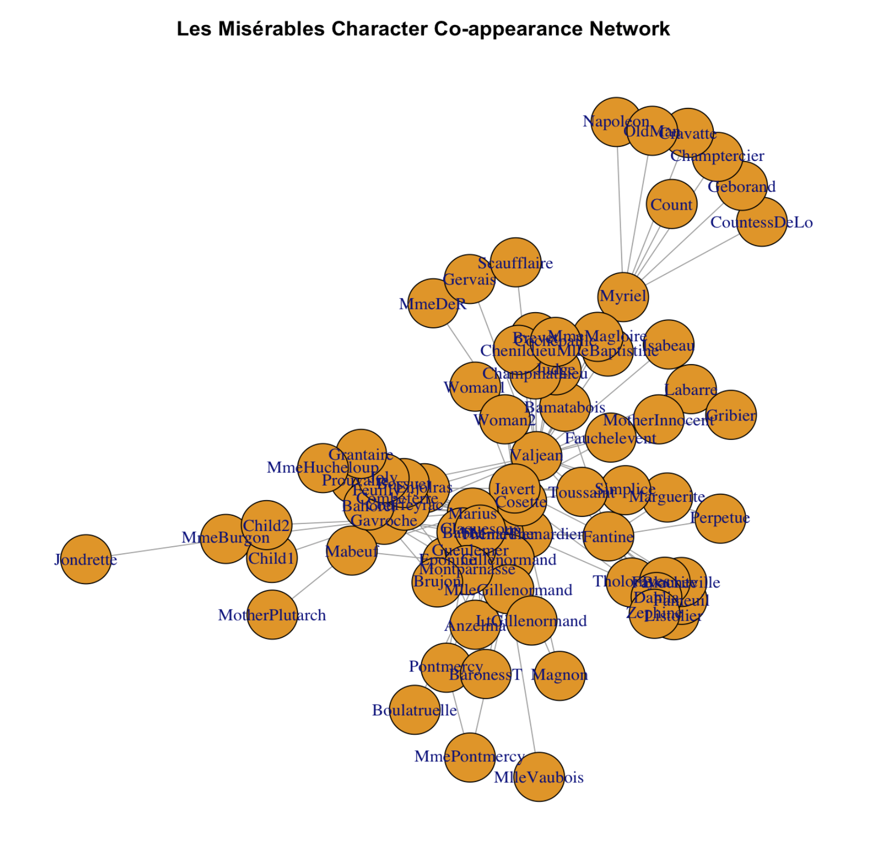
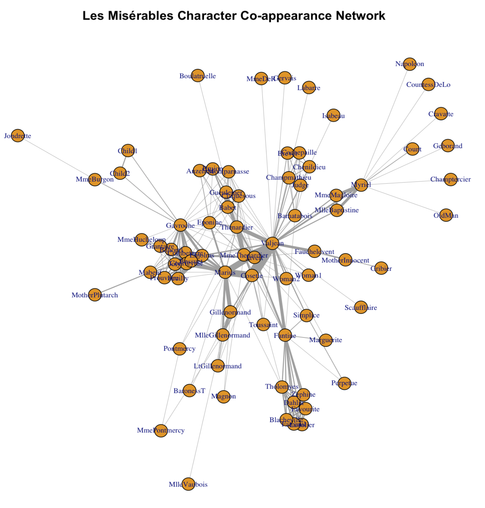
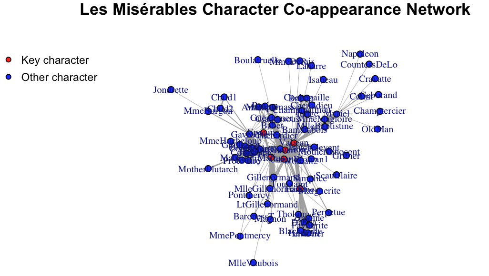
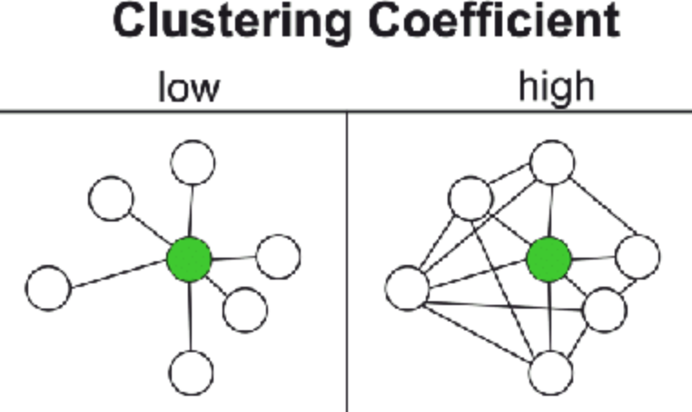

# Social Network Analysis

This week our tutorial will cover social network analysis. Social network analysis focuses on patterns of relations between actors and is a key approach to study issues like homopohily and social diffusion. 

## Understanding network data structures in R

One simple way to represent a graph is to list the edges, which we will refer to as an edge list. For each edge, we just list who that edge is incident on. Edge lists are therefore two column matrices (or dataframe in the language of R) that directly tell the computer which actors are tied for each edge. In a directed graph, the actors in column A are the sources of edges, and the actors in Column B receive the tie. In an undirected graph, order doesn’t matter.

Let me use a real social network data as a guiding example for the tutorial. This network is a network of scene coappearances of characters in Victor Hugo's novel "Les Miserables." Edge weights denote the number of such occurrences. The data source is D. E. Knuth, "The Stanford GraphBase: A Platform for Combinatorial Computing." Addison-Wesley, Reading, MA (1993).

I converted the raw data format to make it easy for use in R. Let's load the "lesmis_edges.csv" first, which is the edge list file. 

```r
edges  <- read.csv("lesmis_edges.csv")
```

Let's take a look at this dataframe using function head():

```r
head(edges)
```
```r
  source target weight
1      1      2      1
2      1      3      8
3      1      4     10
4      1      5      1
5      1      6      1
6      1      7      1
```
We can see that there are three columns. The first two columns define the source and the target of the connection. The numerical values in these two columns represent different network nodes (here they represent individual characters in the novel). They do not have to be numerical IDs and we could put in actual character names instead, which is more readable but take up more storage space on our disk. 

In the case of co-appearence, linkages are not directional. Thus, each pair of node IDs only appear once. For a directed network, each pair of nodes could appear twice (e.g., 1 -- > 2 vs. 2 -- > 1. In the first case, 1 is the sending node and in the second case, 2 is the sending node).

For the edgelist dataframe, we only report node pairs that have links. Thus the third column, which represents the intensity of the connection (i.e., edge weight), is never zero. The "weight" column could have varied values if the network is weighted. The Les Miserables network is weighted that weights represent the number of co-occurence. For some networks, egdes are not weighted (i.e., weight column = 1 for all rows). For such unweighted networks, we could omit the "weight" column. 

Besides the edgelist data, when conducting social network analysis in R, we often have a second dataframe that stores node-level attributes (though it is not required to have this node-level dataframe to conduct network analysis in R). For the Les Miserables network, we have node-level attributes that store the actual charater names that the nodes correspond to and whether the character is a key character in the novel. 

```r
nodes  <- read.csv("lesmis_nodes.csv")
```

Let's take a look at this dataframe using function head():

```r
head(nodes)
```

```r
  id           name key_character
1  1         Myriel            no
2  2       Napoleon            no
3  3 MlleBaptistine            no
4  4    MmeMagloire            no
5  5   CountessDeLo            no
6  6       Geborand            no
```

The first column "id" corresponds to the values in the "source" and "target" columns for the edgelist dataframe. For the node dataframe, each node appears once and the columns represent their corresponding attributes. 

## Visualizing network data in R

Now with the edgelist and the node-level attributes, we are ready to construct a social network using R! Specifically, we will use the "igraph" pacakge in R. If this is your first time using it, again, remeber you need to install it first.

```r
install.packages("igraph")
```

Then we can activate this package:
```r
library(igraph)
```

Then we can construct the network using function graph_from_data_frame(). The first parameter is our edgelist dataframe. The second parameter defines whether or not the network is directed. The third defines node-level attributes:

```r
g <- graph_from_data_frame(edges, directed = FALSE, vertices = nodes)
```

We can check some quick statistics for this network.

```r
#Number of nodes 
vcount(g)

#Number of edges 
ecount(g)

#Is directed?
is_directed(g)

#Is weighted?
is_weighted(g)

#node names
V(g)$names

#edge weigths
E(g)$weight
```

Let's also quickly plot it!

```r
plot(
  g,
  main = "Les Misérables Character Co-appearance Network"
)
```


It looks okay but we can for sure make it prettier!

```r
set.seed(12)  # for reproducible layout
plot(
  g,
  layout = layout_with_fr(g),
  vertex.label.cex = 0.7,
  vertex.size     = 6,
  edge.width      = 0.5 * E(g)$weight,  # edge widths scale with weight
  main = "Les Misérables Character Co-appearance Network"
)
```


Wow! Much better! So what we did? layout_with_fr() is a function that forces R to arrange the network using the so-called "Fruchterman and Reingold algorithm". Essentially, nodes with denser connections are put closer under this algorithm. vertex.label.cex tunes the label size for the node label (character name in this case). vertex.size tunes the size for the node. edge.width adjusts for the width of the edges. There are far more parameters that you can tune! Check out https://igraph.org

Now let's further improve the plot! Recall we have this one additional column called "key_character" for the node dataframe. Let's highlight the main/key characters with a different color.

```r
V(g)$color <- "blue"
V(g)$color[V(g)$key_character == "yes"] <- "red"

set.seed(12)                       # for reproducible layout
plot(
  g,
  layout = layout_with_fr(g),
  vertex.label.cex = 0.7,
  vertex.size     = 6,
  vertex.color=V(g)$color,
  edge.width      = 0.5 * E(g)$weight,  # edge widths scale with weight
  main = "Les Misérables Character Co-appearance Network"
)

legend(
  "topleft",
  legend = c("Key character", "Other character"),
  pt.bg  = c("red", "blue"),
  pch    = 21,
  bty    = "n",
  cex    = 0.8
)
```


Main characters are indeed more central in the network!

Now let's try to explore the network more to quantitatively describe its structure. 

## Key network measures
### Degree (“How many friends do I have?”)
For an undirected network, the degree of a node n is the count of edges incident on n. For a directed network, a node n can have in-degree (count of inflows) and out-degree (cout of outflows) 

```r
degree(g)                     # degree
```

Let's sort the result.
```r
sort(degree(g))               
```

Output: 
```r
        Napoleon     CountessDeLo         Geborand     Champtercier 
               1                1                1                1 
        Cravatte            Count           OldMan          Labarre 
               1                1                1                1 
          MmeDeR          Isabeau          Gervais      Scaufflaire 
               1                1                1                1 
    Boulatruelle          Gribier        Jondrette      MlleVaubois 
               1                1                1                1 
  MotherPlutarch       Marguerite         Perpetue           Woman1 
               1                2                2                2 
  MotherInnocent        MmeBurgon           Magnon     MmePontmercy 
               2                2                2                2 
       BaronessT           Child1           Child2   MlleBaptistine 
               2                2                2                3 
     MmeMagloire        Pontmercy          Anzelma           Woman2 
               3                3                3                3 
       Toussaint     Fauchelevent         Simplice   LtGillenormand 
               3                4                4                4 
           Judge     Champmathieu           Brevet       Chenildieu 
               6                6                6                6 
     Cochepaille        Listolier          Fameuil      Blacheville 
               6                7                7                7 
       Favourite           Dahlia          Zephine     Gillenormand 
               7                7                7                7 
MlleGillenormand           Brujon     MmeHucheloup       Bamatabois 
               7                7                7                8 
       Tholomyes        Prouvaire     Montparnasse           Myriel 
               9                9                9               10 
       Grantaire        Gueulemer            Babet       Claquesous 
              10               10               10               10 
   MmeThenardier          Cosette          Eponine           Mabeuf 
              11               11               11               11 
      Combeferre          Feuilly          Bahorel             Joly 
              11               11               12               12 
      Courfeyrac          Bossuet          Fantine         Enjolras 
              13               13               15               15 
      Thenardier           Javert           Marius         Gavroche 
              16               17               19               22 
         Valjean 
              36 
```

If the network is directed, we can calculate in-degree:

```r
degree(g, mode = "in)                  
```

### Weighted degree (strength)
The strength of node n is the sum of edge weights. 

```r
sort(strength(g))
```
```r
        Napoleon     CountessDeLo         Geborand     Champtercier 
               1                1                1                1 
        Cravatte           OldMan          Labarre           MmeDeR 
               1                1                1                1 
         Isabeau          Gervais      Scaufflaire     Boulatruelle 
               1                1                1                1 
       Jondrette      MlleVaubois            Count          Gribier 
               1                1                2                2 
          Magnon     MmePontmercy        BaronessT       Marguerite 
               2                2                2                3 
        Perpetue           Woman1        Pontmercy        MmeBurgon 
               3                3                3                3 
  MotherPlutarch   MotherInnocent        Toussaint          Anzelma 
               3                4                4                5 
          Woman2   LtGillenormand           Child1           Child2 
               5                5                5                5 
    MmeHucheloup         Simplice       Bamatabois           Brevet 
               7                8               11               11 
      Chenildieu      Cochepaille     Montparnasse           Brujon 
              11               11               12               13 
    Fauchelevent            Judge     Champmathieu           Mabeuf 
              14               14               14               16 
       Grantaire   MlleBaptistine      MmeMagloire          Eponine 
              16               17               19               19 
       Prouvaire       Claquesous MlleGillenormand        Listolier 
              19               20               23               24 
         Fameuil          Zephine      Blacheville           Dahlia 
              24               24               25               25 
       Gueulemer        Tholomyes        Favourite            Babet 
              25               26               26               27 
    Gillenormand           Myriel    MmeThenardier          Feuilly 
              29               31               34               38 
         Bahorel             Joly          Fantine           Javert 
              39               43               47               47 
        Gavroche       Thenardier          Bossuet          Cosette 
              56               61               66               68 
      Combeferre       Courfeyrac         Enjolras           Marius 
              68               84               91              104 
         Valjean 
             158  
```

### Global Clustering Coefficient (GCC)

The global clustering coefficient measures the tendency of nodes in a network to cluster together. It quantifies the overall connectivity and cohesion of the network by considering all possible triplets of nodes. In essence, it indicates how much the network resembles a collection of closely connected groups (clusters). 



```r
transitivity(g, "global")
```
The output: 
```r
0.4989316
```
Wow the network is very cohesive because GCC is between 0 and 1. 

### Average path length (APL)
Average Path Length (APL) is a key indicator of how interconnected a network is, with shorter APLs generally indicating a more efficient network. APL is calculated by finding the shortest path between all pairs of nodes in the network and then averaging those shortest path lengths. 
### 


