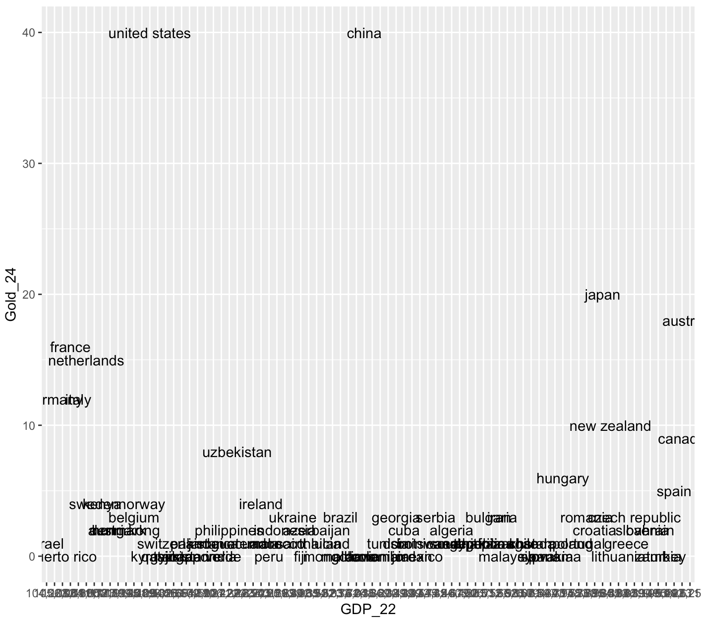
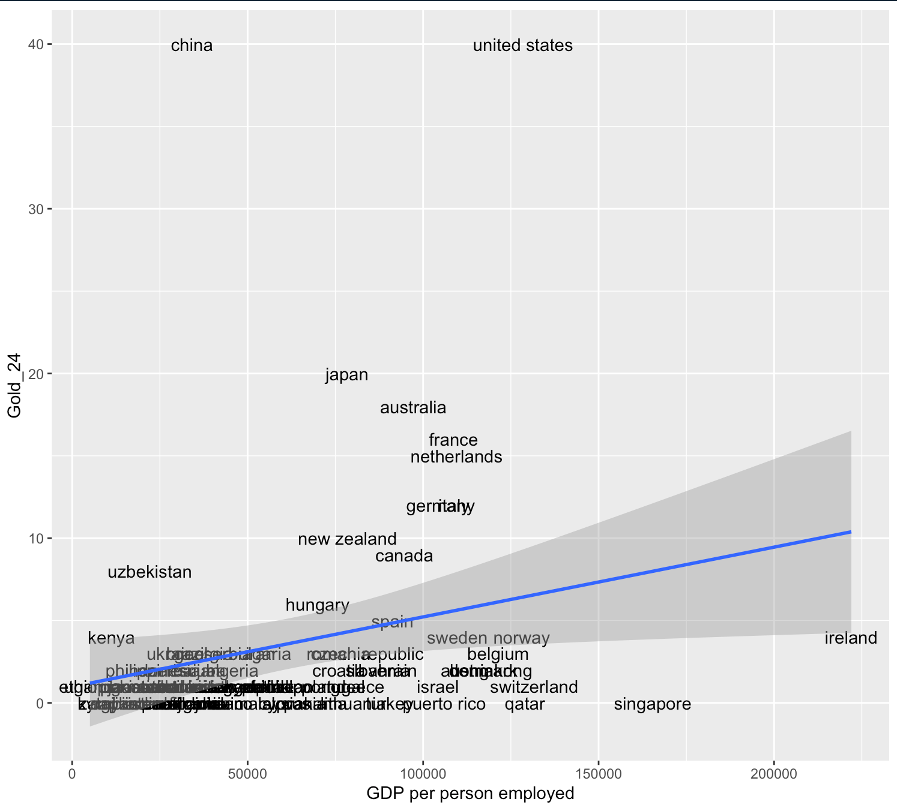
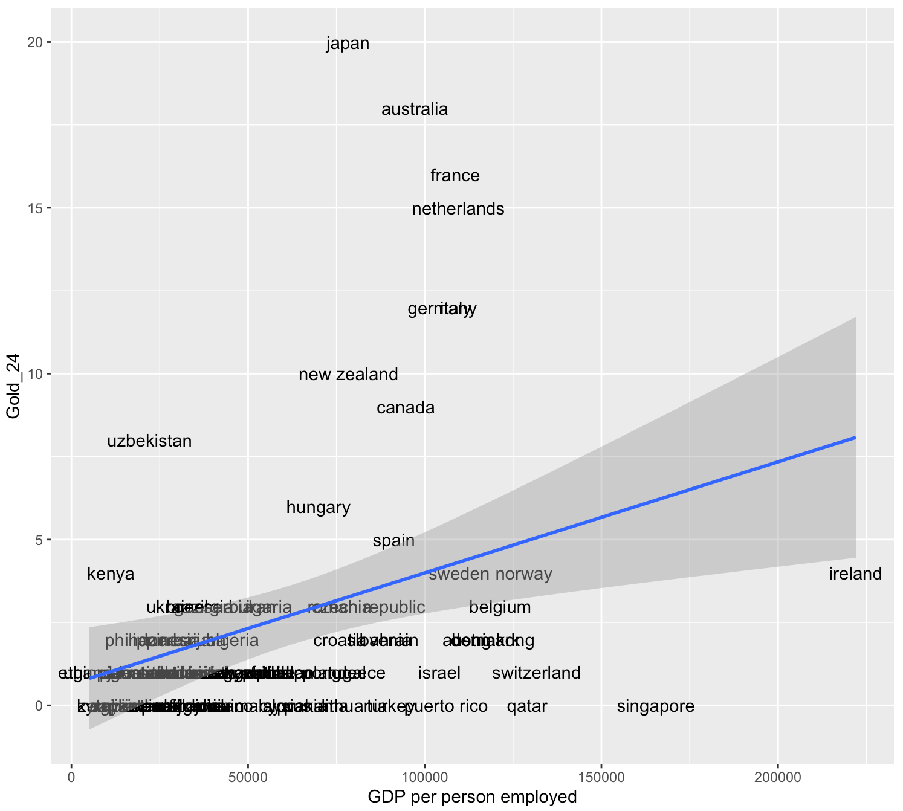

# Collecting data online

*This section is drafted based on Dr. Mark Hoffman's previous SOC 10 lab notes.*
*Conducting research via webpage scrapping and API call is likely under the regulation of University IRB board. Please consult Stanford IRB office for detail.*

In previous tutorials, we learned how to download datasets online or collect them ourselves using survey software like Qualtrics and to load them into R for analysis. A lot of computational social science data, however, doesn’t come in such easily downloadable form. This is for a couple reasons. For one, companies might provide their data for viewing on a webpage rather than in a .csv or .dta file. Wikipedia, for example, contains thousands and thousands of data tables, concerning topics from GDP per capita by country to the number and types of awards won by Kanye West. These data are publicly available in the form of tables on their various webpages; but there is no single place where you can download all of them. We therefore will need to learn how to grab this data off their webpages using something called web scraping or crawling in R. This is, in part, what Google uses to index the content of websites and offer them to you following your searches.

Alternatively, the amount of data that a website provides might just be too large or too heterogenous to reasonably put into a single, downloadable file or else webistes might have privacy and intellectual property concerns, which preclude them from making all of their data easily available to everyone. In such situations, a webiste or organization might provide a tool for accessing their data in an approved fashion, often referred to as an application programming interface (API).

In tutorial, we will learn the aforementioned skills for collecting online data - web scraping and using APIs. Each website and API is different, so the tutorials presented here might not always apply precisely to every use case, but the basic principles should help get you started collecting digital trace data.

## Scraping the web

In the first portion of this tutorial, we will cover web scraping. Web scraping involves pulling the underlying code – HTML, CSS, or Javascript – of website and interpreting or collecting information embedded in that code. When you visit a website, your browser reads the HTML, CSS, and Javascript and through interpreting them, learns how to display that website. HTML defines the meaning and structure of web content, while CSS (Cascading Style Sheets) and Javascript in turn define how that content appears and behaves, respectively.

One of the best packages in R for webscraping is rvest. In particular, it focuses on pulling data from html web pages and has a number of functions for doing so. You could build a program which grabs the HTML from websites and searches through it for information, but it would be very difficult. rvest has done the difficult work for you.

Let’s begin by installing rvest.

```r
install.packages("rvest")
```

Now we can load it into R. Let’s load in tidyverse too.

```r
library(rvest)
library(tidyverse)
```

Great! If you want to read more about rvest beyond what is covered here, check out its reference manual online: https://cran.r-project.org/web/packages/rvest/rvest.pdf

The core function in rvest for grabbing the html data from a website is html(). We will use it to grab data from Wikipedia about the GDP per person employed. We could grab any webpage using this function and it is worth exploring on your own time.

```r
webpage <- read_html("https://en.wikipedia.org/wiki/List_of_countries_by_GDP_(PPP)_per_person_employed")
```
```r
webpage
```

You should be able to see the below output:

```r
{html_document}
<html class="client-nojs vector-feature-language-in-header-enabled vector-feature-language-in-main-page-header-disabled vector-feature-page-tools-pinned-disabled vector-feature-toc-pinned-clientpref-1 vector-feature-main-menu-pinned-disabled vector-feature-limited-width-clientpref-1 vector-feature-limited-width-content-enabled vector-feature-custom-font-size-clientpref-1 vector-feature-appearance-pinned-clientpref-1 vector-feature-night-mode-enabled skin-theme-clientpref-day vector-sticky-header-enabled vector-toc-available" lang="en" dir="ltr">
[1] <head>\n<meta http-equiv="Content-Type" content="text/html; chars ...
[2] <body class="skin--responsive skin-vector skin-vector-search-vue  ...
```

Cool! With the HTML in our R environment, we can now use other functions to extract information from it. How do we do that?

Well first, we have to know what function to use. There are quite a few - for example, html_attr extracts text or tag names, html_nodes extracts sections or divisions of the html file by name or type, html_table extracts tables inside of sections, and html_text extracts text.

Once we know the function that we need to use, then we have to figure out what we want to pull from the html.

1. Go to our URL: https://en.wikipedia.org/wiki/List_of_countries_by_GDP_(PPP)_per_person_employed

2. Find the table to extract.

3. Right-click the table -> click Inspect

4. A pop-up menu will show and you will need to select the table element

5. Right-click the table element -> Copy -> Copy Xpath

```r
webpage_table_html <-html_nodes(webpage, xpath='/html/body/div[2]/div/div[3]/main/div[3]/div[3]/div[1]/table/tbody/tr[2]/td[1]/table')
```
```r
webpage_table_html
```
Output:
```r
{xml_nodeset (1)}
[1] <table class="wikitable sortable" style="margin-left:auto;margin- ...
```
The problem is that the table is still in html format - thankfully, rvest has a function, html_table, which converts such information into an R data.frame. It saves each table in the html as a data.frame inside of a single list, so we will have to index the list we want. In this case, there is only one table on the page so we will index the first item of the list.

```r
gdp_info <- html_table(webpage_table_html, fill = T, trim = T)
```
```r
class(gdp_info)
```
Output:
```r
[1] "list"
```
```r
gdp_info <- gdp_info[[1]]
```
There isn’t much we can do with a single column of data like this. So what if we scraped data about countries from another Wikipedia page and merged it to this one? For example, we could evaluate if GDP per hour worked (which implicitly adjusts for country size and captures hourly returns to labor) is correlated with how a country performed at the 2016 Olympic games.

First let’s grab the info just like we did before.

```r
# Grab the html
olympics_webpage <- read_html("https://en.wikipedia.org/wiki/2024_Summer_Olympics_medal_table")
# Extract the table
olympics_webpage_table_html <-html_nodes(olympics_webpage, xpath='/html/body/div[2]/div/div[3]/main/div[3]/div[3]/div[1]/table[3]')
# Convert the table to a data.frame
medals_info <- html_table(olympics_webpage_table_html, fill = T, trim = T)
medals_info <- medals_info[[1]]
```

Then let’s inspect the data. Does it look like it can be easily merged with our GDP data? Perhaps, but there is one problem. Some countries (e.g., United States and France ) have special symbols after their names.

```r
# also need tidyverse pakacge 
library(stringr)

medals_info <- medals_info %>% 
  mutate(
    NOC = NOC %>% 
      str_remove_all("[^[:alpha:][:space:]]") %>%  # keep only letters & spaces
      str_to_lower() %>%                           # convert to lowercase
      str_squish()                                 # trim / collapse spaces
  )
```

```r
head(medals_info)
```
Output:
```r
# A tibble: 6 × 6
  Rank  NOC            Gold Silver Bronze Total
  <chr> <chr>         <int>  <int>  <int> <chr>
1 1     united states    40     44     42 126  
2 2     china            40     27     24 91   
3 3     japan            20     12     13 45   
4 4     australia        18     19     16 53   
5 5     france           16     26     22 64   
6 6     netherlands      15      7     12 34   
```
Let's do the same for our GDP data
```r
gdp_info <- gdp_info %>% 
  mutate(
    Country = Country %>% 
      str_remove_all("[^[:alpha:][:space:]]") %>%  # keep only letters & spaces
      str_to_lower() %>%                           # convert to lowercase
      str_squish()                                 # trim / collapse spaces
  )
```
Now that both datasets have the same way of writing country names, we can merge the data by Country.
```r
merged_df <- merge(gdp_info, medals_info, by.x = "Country", by.y="NOC")
```
Take a look at the size of merged_df on your Environment panel. What you notice? It only contains 82 rows. Why? This is because only 82 countries have both GDP and medal infromation.

Alternatively, if you want to keep all countries which appeared in the GDP table, you can 
```r
merged_df_gdp <- merge(gdp_info, medals_info, by.x = "Country", by.y="NOC",all.x=TRUE)
```

And we can plot results using ggplot, just like we did in our first R lesson! First, let’s select the columns we want using tidyverse.
```r
merged_df <- merged_df %>% select(Country,`GDP per personemployed(2017 Intl. $)`,Total,Gold) %>% rename(Country = Country,GDP_22 = `GDP per personemployed(2017 Intl. $)`,Total_Medal_24 = Total, Gold_24 = Gold)
```
```r
head(merged_df)
```
Output:
```r
  Country  GDP_22 Total_Medal_24 Gold_24
1   albania  34,018              2       0
2   algeria  45,619              3       2
3 argentina  52,012              3       1
4   armenia  34,869              4       0
5 australia  97,250             53      18
6   austria 112,589              5       2
```
Let's plot now!
```r
ggplot(merged_df, aes(x = GDP_22, 
                      y = Gold_24, 
                      label = Country)) + 
                      geom_text() + 
                      geom_smooth(method='lm', formula= y~x)
```


This plot is terrible! What is up with the x-axis? It doesn’t seem to be detecting either axis as numbers. Let’s convert them using as.numeric so that R doesn’t get confused again. There is a problem though.. the GDP values have commas in them. R won’t recognize them as potential numbers and will return NA when we run as.numeric. We can use the gsub function to substitute things in a string for something else. Let’s use it to remove the commas by substituting commas with empty strings.
```r
merged_df$GDP_22 <- gsub(",", "", merged_df$GDP_22)
merged_df$GDP_22 <- as.numeric(merged_df$GDP_22)
```
Let's try again!
```r
ggplot(merged_df, aes(x = GDP_22, 
                      y = Gold_24, 
                      label = Country)) + 
                      geom_text() + 
                      geom_smooth(method='lm', formula= y~x) +
                      xlab("GDP per person employed")
```


What do you see? Seems like there is a positive correlation between the two! Let's
also fit a simple linear regression on it!
```r
Model1 <- lm(Gold_24 ~ GDP_22, data = merged_df)
```
```r
summary(Model1)
```
Output:

```r
Call:
lm(formula = Gold_24 ~ GDP_22, data = merged_df)

Residuals:
   Min     1Q Median     3Q    Max 
-7.992 -2.786 -1.710 -0.210 37.568 

Coefficients:
             Estimate Std. Error t value Pr(>|t|)  
(Intercept) 9.846e-01  1.401e+00   0.703   0.4843  
GDP_22      4.235e-05  1.872e-05   2.262   0.0264 *
---
Signif. codes:  0 ‘***’ 0.001 ‘**’ 0.01 ‘*’ 0.05 ‘.’ 0.1 ‘ ’ 1

Residual standard error: 6.963 on 80 degrees of freedom
Multiple R-squared:  0.06012,	Adjusted R-squared:  0.04837 
F-statistic: 5.117 on 1 and 80 DF,  p-value: 0.0264
```
The explanatory power of GDP per capita is weak! What other factors you can think of that contribute to the number of gold medals?

What if we exclude China and United States?
```r
merged_df_filtered <- merged_df %>% filter(Country != "china" & Country != "united states")
```

```r
ggplot(merged_df_filtered, aes(x = GDP_22, 
                      y = Gold_24, 
                      label = Country)) + 
                      geom_text() + 
                      geom_smooth(method='lm', formula= y~x) +
                      xlab("GDP per person employed")
```


The pattern is still far from linear. 

## Google News API
*This section is drafted based on https://paulcbauer.github.io/apis_for_social_scientists_a_review/google-news-api.html.*

Google News API allows you to extract news headlines and contents from various global news sources.

```r
install.packages('httr')
library(httr)
```
### Prerequistes 
You need an API key, which can be requested via https://newsapi.org/register.
Note that there are a set of limitations for the free version. You can purchase a paid version for better service. But a free version is good enough for this lab's deomonstration!

### Get started

The API has three main endpoints:
https://newsapi.org/v2/everything?, documented at https://newsapi.org/docs/endpoints/everything

https://newsapi.org/v2/top-headlines/sources?, documented at https://newsapi.org/docs/endpoints/sources

https://newsapi.org/v2/top-headlines?, documented at https://newsapi.org/docs/endpoints/top-headlines

Let's try to use the everything endpoint to search for keyword "Canada"

```r
endpoint_url <- "https://newsapi.org/v2/everything?"
my_query <- "canada"
my_start_date <- Sys.Date() - 7
Sys.setenv(NEWS_API_KEY = "89610f37b61a43c389d3830aebff2a81") #change to your actual API key
my_api_key <- Sys.getenv("NEWS_API_KEY") 

params <- list(
  "q" = my_query,
  "from" = my_start_date,
  "language" = "en",
  "sortBy" = "publishedAt")

news <- httr::GET(url = endpoint_url, 
               httr::add_headers(Authorization = my_api_key),
               query = params)

result <- httr::content(news) 
```
Let's see the articles we get!

```r
second_article <- result$articles[[2]]  
second_article$title
second_article$url
second_article$source
second_article$description
```

```r
> second_article$title
[1] "Amazon launches its first internet satellites to compete against SpaceX’s Starlinks"
> second_article$url
[1] "https://financialpost.com/pmn/amazon-launches-its-first-internet-satellites-to-compete-against-spacexs-starlinks"
> second_article$source
$id
[1] "financial-post"

$name
[1] "Financial Post"

> second_article$description
[1] "CAPE CANAVERAL, Fla. (AP) — Amazon’s first batch of internet satellites rocketed into orbit Monday, the latest entry in the mega constellation market currently dominated by SpaceX’s thousands of Starlinks. The United Launch Alliance’s Atlas V rocket carried u…"
```
