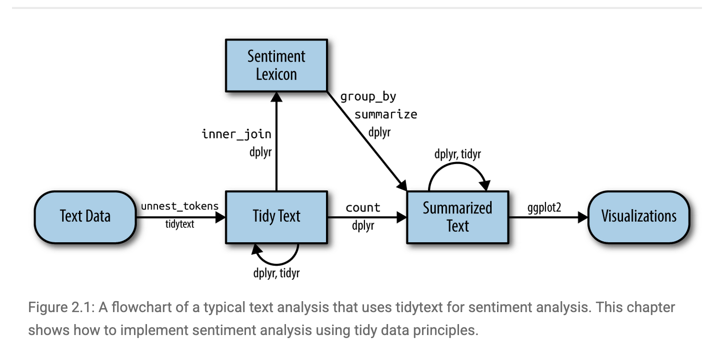
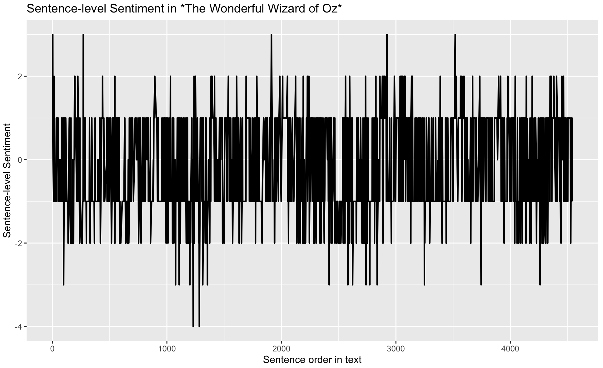
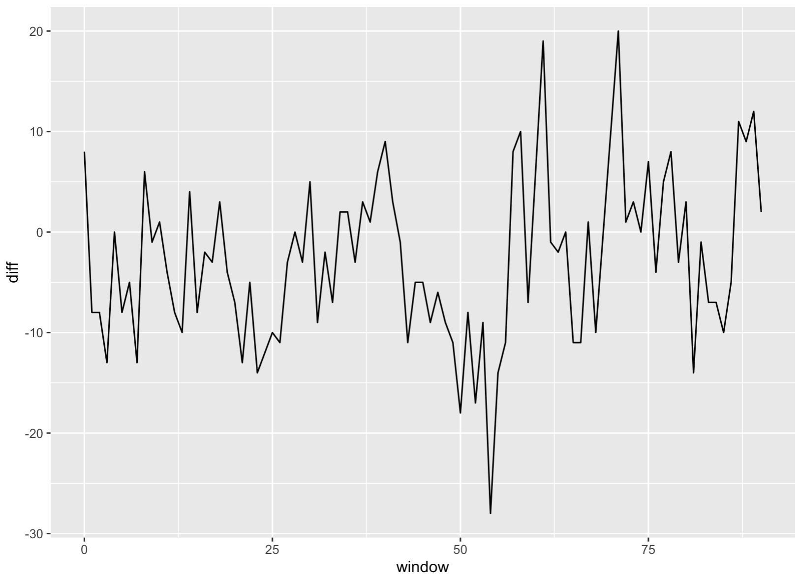
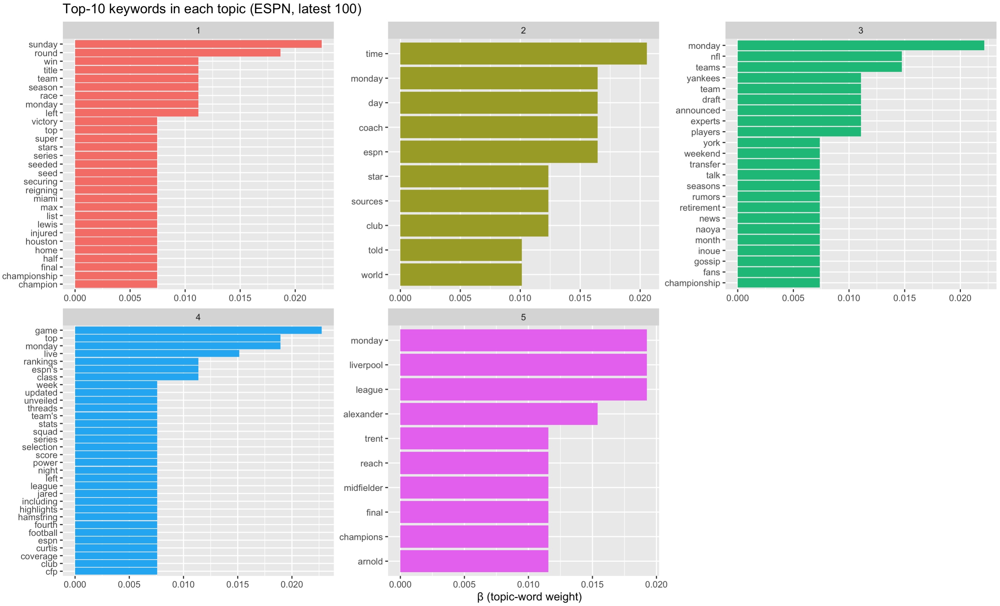
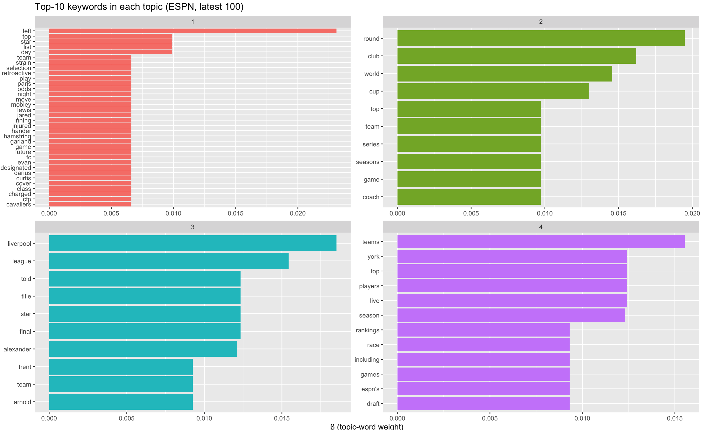
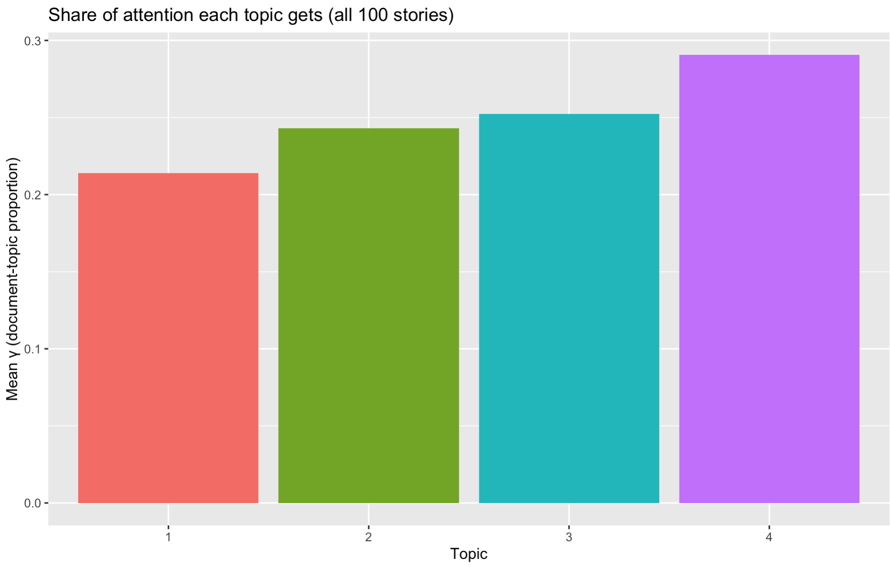

# Text Analysis

*This section is inspired by https://m-clark.github.io/text-analysis-with-R/sentiment-analysis.html.*

Text data are now everywhere: tweets and forum posts, press releases and policy documents, interview transcripts and open-ended survey answers. Turning that unstructured torrent into systematic evidence is quickly becoming a core skill for social scientists, data analysts, and anyone who needs to understand language at scale.

This hands-on R tutorial walks you through three foundational techniques—sentiment analysis, topic modeling, and word embeddings—that together cover the full spectrum from simple lexicon-based scoring to advanced distributional semantics. 

## Sentiment Analysis
Sentiment analysis is often the most intuitive entry point to text analytics. Its goal is to quantify the emotional tone of a corpus. Although a human reader can judge sentiment in a single sentence, automated methods are indispensable when the dataset grows to hundreds of thousands or even millions of sentences and documents.

The tidytext package in R streamlines this process. Let's start by installing this pacakge.

```r
install.packages("tidytext")
library(tidytext)
```

A common tidy-text sentiment method treats a document’s sentiment as the sum of the sentiments of its individual words. We can use existing lexicons to map individual words with sentiment. 

Lexicons available in tidytext:
AFINN – assigns each word an integer score from –5 (very negative) to +5 (very positive).
bing – labels words simply as positive or negative.
nrc – labels words as positive or negative and in eight basic emotions (anger, anticipation, disgust, fear, joy, sadness, surprise, trust).

All three lexicons are unigram-based and cover thousands of English words, making them general-purpose tools for quick sentiment tagging within the tidy ecosystem.

Let's take a look at the "bing" lexicon.

```r
get_sentiments("bing")
```

```r
# A tibble: 6,786 × 2
   word        sentiment
   <chr>       <chr>    
 1 2-faces     negative 
 2 abnormal    negative 
 3 abolish     negative 
 4 abominable  negative 
 5 abominably  negative 
 6 abominate   negative 
 7 abomination negative 
 8 abort       negative 
 9 aborted     negative 
10 aborts      negative 
# ℹ 6,776 more rows
# ℹ Use `print(n = ...)` to see more rows
```

Let's store the "bing" lexicon into a dataframe and use it to assess the  sentiment of the novel "The Wonderful Wizard of Oz". 

```r
bing_sent <- get_sentiments("bing")
```

Lexicon gives us a dictionary/reference to label the sentiments of the words that are under evaluation. But how exactly should we conduct sentiment analysis for a text? Below visualizes the workflow of conducting sentiment analysis using tidytext [Figure Source](https://www.tidytextmining.com/sentiment).



Let's start by importing the text of the novel "The Wonderful Wizard of Oz". We can access the text via the Project Gutenberg (https://www.gutenberg.org), a library of over 75,000 free eBooks. Let's install the R packakge for Project Gutenberg and retrieve the text of the novel "The Wonderful Wizard of Oz".

```r
install.packages("gutenbergr")
library(gutenbergr)
book_oz = gutenberg_works(title == "The Wonderful Wizard of Oz")  
```

Let's take a look of the book_oz object we just created.

```r
book_oz
```
```r
# A tibble: 1 × 8
  gutenberg_id title                author gutenberg_author_id language gutenberg_bookshelf rights has_text
         <int> <chr>                <chr>                <int> <chr>    <chr>               <chr>  <lgl>   
1        43936 The Wonderful Wizar… Baum,…                  42 en       ""                  Publi… TRUE    
```

We can donwload the text by going to the website and using our gutenberg_id.

```r
text_oz = gutenberg_download(book_oz$gutenberg_id)
```

Let's take a look at text_oz and notice that there are still things to be cleaned. We first slice off the initial parts we don’t want like title, author etc. Then we get rid of other tidbits that would interfere, using a little regex as well to aid the process. 

```r
library(tidyverse)
text_oz_filtered = text_oz %>% 
  slice(-(1:20)) %>%  #Drops the first 20 rows (negative slice = “all but”). These rows are usually Gutenberg boiler-plate (title page, licensing notes, table of contents). 
  filter(!text==str_to_upper(text),            # Eliminates rows whose entire string is in ALL-CAPS. In a Shakespeare script those are mostly block headers—THE PROLOGUE, ENTER HORATIO, etc.—which carry no narrative sentiment.
         !text==str_to_title(text),            # Eliminates rows whose string equals its Title-Case version. 
         !str_detect(text, pattern='^(Scene|SCENE)|^(Act|ACT)|^\\[')) %>% 
  select(-gutenberg_id) %>%  #Drops the unneeded gutenberg_id column to declutter the data frame.
  unnest_tokens(sentence, input=text, token='sentences') %>%  #Splits each surviving line into individual sentences (tidytext tokenization), giving one row per sentence—ideal granularity for sentiment scoring.
  mutate(sentenceID = 1:n()) #Adds a running sentenceID so every sentence has a unique key for joins, plotting, or ordering later on.
```

In addition, we can remove stopwords like a, an, the etc., and tidytext comes with a stop_words data frame. 

```r
head(stop_words$word)
```
```r
"a"         "a's"       "able"      "about"     "above"     "according"
```

Let's now parse the sentence-level document into words and remove stop_words using anti_join.

```r
text_oz_filtered = text_oz_filtered %>% 
  unnest_tokens(output=word, input=sentence, token='words') %>%   
  anti_join(stop_words)
```

Let's take a look at the the most frequent words appeared in the novel.

```r
text_oz_filtered %>% 
  count(word) %>% 
  arrange(desc(n))
```

```r
# A tibble: 2,508 × 2
   word          n
   <chr>     <int>
 1 dorothy     343
 2 scarecrow   215
 3 woodman     172
 4 lion        171
 5 oz          161
 6 tin         139
 7 witch       123
 8 green       105
 9 girl         93
10 head         90
# ℹ 2,498 more rows
# ℹ Use `print(n = ...)` to see more rows
```

We can then merge the word-level data with our Bing lexicon to map words with sentiments.

```r
oz_sentiment = text_oz_filtered %>% 
  inner_join(bing_sent)
```

```r
oz_sentiment
```

```r
# A tibble: 1,943 × 3
   sentenceID word      sentiment
        <int> <chr>     <chr>    
 1          2 healthy   positive 
 2          2 wholesome positive 
 3          3 love      positive 
 4          3 fantastic positive 
 5          3 marvelous positive 
 6          4 unreal    positive 
 7          6 happiness positive 
 8          6 childish  negative 
 9         11 horrible  negative 
10         12 fearsome  negative 
# ℹ 1,933 more rows
# ℹ Use `print(n = ...)` to see more rows
```

We can now aggregate the sentiments to the sentence level. Let's count positive vs. negative words in each sentence since we assign binary sentiments to words. 

```r
sentiment_counts <- oz_sentiment %>%               
  count(sentenceID, sentiment) %>%                  # number of words by sentiment per sentence
  pivot_wider(names_from  = sentiment,              # … → wide form: one row per sentence
              values_from = n,
              values_fill = 0)                      # sentences w/ no pos/neg get 0
```
Let's get an assessment on the sentence-level sentiment by taking the difference between the count of positive words and the count of negative words.
```
sentiment_counts$diff <- sentiment_counts$positive - sentiment_counts$negative
```

```r
ggplot(sentiment_counts,
       aes(x = sentenceID, y = diff)) +
  geom_line(size = 0.8) +
  labs(title = "Sentence-level Sentiment in *The Wonderful Wizard of Oz*",
       x = "Sentence order in text",
       y = "Sentence-level Sentiment") 
```


Let's smooth the plot a bit by grouping every 50 sentences together.

```r
sentiment_counts %>%
  mutate(window = sentenceID %/% 50) %>%          # 50-sentence blocks
  group_by(window) %>%
  summarise(diff = sum(positive) - sum(negative)) %>%
  ggplot(aes(window, diff)) + geom_line()
```


## Topic Modeling
Topic modeling is an unsupervised machine-learning technique that scans a collection of documents and groups words that frequently appear together into latent “topics.” Each topic represents a coherent theme—such as “injury reports,” “transfer rumors,” or “playoff predictions”—and every article is scored on how strongly it exhibits each theme. 

In this tutorial, I will run a topic model on the latest 100 sports-news articles pulled via a News API. It would quantify how much attention different sports, teams, or issues are receiving. In short, it turns a raw stream of headlines into a structured map of the current sports-news agenda.

Let's go back to the News API to retrieve the latest 100 articles from ESPN. 

```r
library(httr)        # talk to web APIs
library(jsonlite)    # parse JSON responses

endpoint_url <- "https://newsapi.org/v2/everything"

Sys.setenv(NEWS_API_KEY = "insert your api here")   
my_api_key <- Sys.getenv("NEWS_API_KEY")

params <- list(
  domains   = "espn.com",        # only ESPN
  language  = "en",
  pageSize  = 100,               # max per call
  sortBy    = "publishedAt"
)

resp <- GET(
  url   = endpoint_url,
  query = params,
  add_headers(Authorization = my_api_key)
)

## Parse JSON → tibble with title + description
articles_df <- content(resp, as = "text", encoding = "UTF-8") %>%
  fromJSON(flatten = TRUE) %>%
  pluck("articles") %>%
  as_tibble() %>%
  select(title, description)                      # keep only what we need
```
Let's take a look at articles_df
```r
head(articles_df)
```
```r
# A tibble: 6 × 2
  title                                                        description     
  <chr>                                                        <chr>           
1 Hamilton Miami radio drama borne from Ferrari's lack of pace "Lewis Hamilton…
2 Reds rookie Callihan injures arm on sliding catch            "With two outs …
3 Dodgers' Teoscar Hernández (hamstring) exits                 "Dodgers outfie…
4 Mets' Winker out 6-8 weeks, Minter's season over             "New York Mets …
5 Man takes 1st steps after 21-foot fall at PNC Park           "The 20-year-ol…
6 Follow live: Braves working on no-hitter vs. Reds            "Live coverage …
```
Let's further clean the corpus
```r
corpus <- articles_df %>%
  filter(!is.na(description)) %>%                 # drop blanks
  mutate(doc_id = row_number())

tokens <- corpus %>%
  unnest_tokens(word, description) %>%            # one row = one word
  anti_join(stop_words, by = "word") %>%          # remove stop-words
  filter(str_detect(word, "[a-z]"))               # drop numbers etc.
```
Let's create a Document-Term Matrix  (articles × words). 
```r
library(tm)
dtm <- tokens %>%
  count(doc_id, word) %>%
  cast_dtm(document = doc_id,
           term      = word,
           value     = n)
```
Let's fit a topic model with 5 topics!
```r
library(topicmodels)
set.seed(42)
k         <- 5
lda_model <- LDA(dtm, k = k, control = list(seed = 42))
```
```r
top_terms <- tidy(lda_model, matrix = "beta") %>%
  group_by(topic) %>%
  slice_max(beta, n = 10) %>%      # 10 “strongest” words
  ungroup() %>%
  arrange(topic, -beta)
```
```r
top_terms
```
```r
# A tibble: 104 × 3
   topic term      beta
   <int> <chr>    <dbl>
 1     1 sunday 0.0224 
 2     1 round  0.0187 
 3     1 left   0.0112 
 4     1 monday 0.0112 
 5     1 race   0.0112 
 6     1 team   0.0112 
 7     1 win    0.0112 
 8     1 season 0.0112 
 9     1 title  0.0112 
10     1 lewis  0.00746
```
```r
top_terms %>%
  mutate(term = reorder_within(term, beta, topic)) %>%
  ggplot(aes(term, beta, fill = factor(topic))) +
  geom_col(show.legend = FALSE) +
  facet_wrap(~ topic, scales = "free") +
  coord_flip() +
  scale_x_reordered() +
  labs(title = "Top-10 keywords in each topic (ESPN, latest 100)",
       x = NULL, y = "β (topic-word weight)")
```

What we see based on the top keywords in each topic:
• Topic 1: post-game wrap-ups / championships
• Topic 3: NFL & MLB rumours
• Topic 5: Liverpool / soccer
• Topic 2: generic words (time, monday, sources) → weak
• Topic 4: catch-all rankings / lists → broad

How can we improve? Let's drop obviously non-semantic tokens first, such as
words like monday, time, espn are schedule/meta terms, not content.

```r
custom_stop <- c(stop_words$word, "monday", "tuesday", "wednesday",
                 "thursday", "friday", "saturday", "sunday",
                 "espn", "time", "sources")
                 
tokens <- tokens %>% filter(!word %in% custom_stop)
```

And let's try a smaller topic size. let's try 4.

Let's recreate the Document-Term Matrix  (articles × words). 
```r
dtm <- tokens %>%
  count(doc_id, word) %>%
  cast_dtm(document = doc_id,
           term      = word,
           value     = n)
```
Let's fit a topic model with 4 topics!
```r
library(topicmodels)
set.seed(42)
k         <- 4
lda_model <- LDA(dtm, k = k, control = list(seed = 42))
```
```r
top_terms <- tidy(lda_model, matrix = "beta") %>%
  group_by(topic) %>%
  slice_max(beta, n = 10) %>%      # 10 “strongest” words
  ungroup() %>%
  arrange(topic, -beta)
```
```r
top_terms
```
```r
# A tibble: 66 × 3
   topic term         beta
   <int> <chr>       <dbl>
 1     1 left      0.0231 
 2     1 top       0.00990
 3     1 star      0.00990
 4     1 day       0.00990
 5     1 list      0.00990
 6     1 lewis     0.00660
 7     1 inning    0.00660
 8     1 play      0.00660
 9     1 game      0.00660
10     1 hamstring 0.00660
# ℹ 56 more rows
# ℹ Use `print(n = ...)` to see more rows
```
```r
top_terms %>%
  mutate(term = reorder_within(term, beta, topic)) %>%
  ggplot(aes(term, beta, fill = factor(topic))) +
  geom_col(show.legend = FALSE) +
  facet_wrap(~ topic, scales = "free") +
  coord_flip() +
  scale_x_reordered() +
  labs(title = "Top-10 keywords in each topic (ESPN, latest 100)",
       x = NULL, y = "β (topic-word weight)")
```


What we observe now?

Topic	1 reads like a “roster moves / injury-updates” grab-bag: headlines about a player left off a squad list, someone placed on retroactive injured list, betting odds if a star “might move”. Still littered with generic tokens (top, day, list).

Topic 2	a broad competition & tournament theme (World Cup, playoff series, round of X).	

Topic 3	is very clear: Liverpool FC / Premier-League storylines, focused on Trent Alexander-Arnold and title talk.	

Topic 4	feels like rankings / power-list / draft coverage; many “Top 10 Teams” or “Live Draft” style blurbs.	Still noisy (live, york, espn’s).

Let's now turn to topic proportions per document  (γ matrix). Essentially, we measure the topic identity for each of the 100 news articles.

```r
doc_topics <- tidy(lda_model, matrix = "gamma")
```
```r
doc_topics
```
```r
 # A tibble: 400 × 3
   document topic   gamma
   <chr>    <int>   <dbl>
 1 1            1 0.993  
 2 2            1 0.997  
 3 3            1 0.996  
 4 4            1 0.996  
 5 5            1 0.00157
 6 6            1 0.00146
 7 7            1 0.00170
 8 8            1 0.00114
 9 9            1 0.00108
10 10           1 0.00128
# ℹ 390 more rows
# ℹ Use `print(n = ...)` to see more rows
```
Let's now plot average prominence of each topic across the corpus. 
```r
doc_topics %>%
  group_by(topic) %>%
  summarise(mean_gamma = mean(gamma)) %>%
  ggplot(aes(factor(topic), mean_gamma, fill = factor(topic))) +
  geom_col(show.legend = FALSE) +
  labs(title = "Share of attention each topic gets (all 100 stories)",
       x = "Topic", y = "Mean γ (document-topic proportion)")
```


We can see that topic 4 (on draft and rankings) is most salient across the articles.

In this section, we see the usefulness of topic modeling and also see its weakness. First, we need to pre-specify K. That is, we must choose the number of topics in advance. In addition, high-frequency function words can dominate a topic if not carefully filtered/weighted.	Finally,some learned topics are statistical artifacts (mixtures of unrelated high-probability words).

