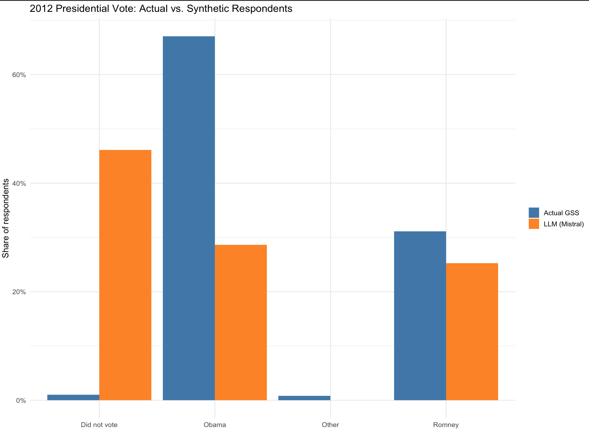

# Large Language Models

This tutorial provides a hands-on way to see how large-language-model (LLM) APIs can be integrated into an R research workflow for computational social science. Using the 2018 General Social Survey, we first review tidy data handling, then prompt Mistral AI to act as “synthetic respondents” whose age, sex, race, income, and education match each sampled case. 

By contrasting the model’s predicted 2012 presidential vote with the survey’s actual vote distribution and visualising the differences, students learn three key lessons: (1) how to call and parameterize an LLM from R with the {tidychatmodels} grammar; (2) how prompt wording and sampling settings affect generated outputs; and (3) why synthetic text should be interpreted cautiously when compared to real human behavior.

## tidychatmodels Package
In this tutorial, we will use the R package "tidychatmodels", a recently developed R package by Albert Rapp for LLM API calls, to explore how to integrate LLMs into computational social science research. I also recommend you to read the online documentation for tidychatmodels: https://albert-rapp.de/posts/20_tidychatmodels/20_tidychatmodels

```
library(devtools)
devtools::install_github("AlbertRapp/tidychatmodels")
library(tidychatmodels)
```
We also need to following packages for today's tutorial
```
library(haven)
library(tidyverse)
library(glue)
library(scales)
library(pins)
```
## LLM as “Synthetic Respondents” for Social Survey: Set-up
In this tutorial, I want to introduce how to interact with LLM with R and how to use LLM to serve as synthetic respondents for social science surveys. 

Let's imagine instead of collecting responses from real humans, we conduct General Social Survey (GSS) on LLM. We can then compare the synthetic responses with the actual human responses. Specifically, I use the 2018 GSS results as the reference. 

Let's first load the 2018 GSS data. Specifically, I am interested in generating sythetic responses for presidential voting preference in the 2012 Prsidential election. 

Let's keeps only the columns we need for this demonstration:

  age – respondent’s age in years (continuous).
  sex – recorded gender (male/female).
  race – self-identified race (white/black/other in 2018).
  realrinc – real annual family income in 2018 dollars (numeric).
  educ – years of schooling completed (0–20).
  pres12 – presidential vote in the 2012 election (Obama, Romney,   Other, Didn’t vote).

These variables give the LLM enough demographic context to generate a plausible vote while keeping the prompt short.

```
gss2018 <- read_dta("GSS2018.dta") %>%
  select(age, sex, race, realinc, educ, pres12) 
```
Let's further clean the data. 

```
gss2018$age <- as.numeric(gss2018$age)
gss2018$realinc <- as.numeric(gss2018$realinc)
gss2018$educ <- as.numeric(gss2018$educ)
gss2018$pres12 <- as.character(gss2018$pres12)
gss2018$sex <- as.character(gss2018$sex)
gss2018$race <- as.character(gss2018$race)

gss2018 <- gss2018 %>%
  filter(!is.na(pres12)) %>%
  filter(!is.na(realinc)) %>%
  filter(age > 26)
```

Let's see the actual voting pattern in the survey
```
vote_dist <- gss2018 %>%                     
  count(pres12) %>%                            
  mutate(pct = n / sum(n)) 
print(vote_dist)
```
1 corresponds to Obama 
2 corresponds to Romney
3 corresponds to Other 
4 corresponds to Did not vote
```
print(vote_dist)
# A tibble: 4 × 3
  pres12     n     pct
  <fct>  <int>   <dbl>
1 1        850 0.647  
2 2        439 0.334  
3 3         18 0.0137 
4 4          7 0.00533
```
Let's code numueric values with actual readable choice categories:
```
gss2018$pres12[gss2018$pres12=="1"] <-"Obama"
gss2018$pres12[gss2018$pres12=="2"] <-"Romney"
gss2018$pres12[gss2018$pres12=="3"] <-"Other"
gss2018$pres12[gss2018$pres12=="4"] <-"Did not vote"

gss2018$sex[gss2018$sex=="1"] <-"Male"
gss2018$sex[gss2018$sex=="2"] <-"Female"

gss2018$race[gss2018$race=="1"] <-"White"
gss2018$race[gss2018$race=="2"] <-"Black"
gss2018$race[gss2018$race=="3"] <-"Non-White and Non-Black"
```

Next is to get sythetic responses from LLM. The first step is creating a prompt (i.e., an instruction) for the LLM. Through prompting, we force the LLM to imagine itself to be a person with certain demographic background:

```
make_prompt <- function(age, sex, race, income, educ) {
  glue("Imagine you are a {age}-year-old {race} {sex} as in 2018. ",
       "You earn ${comma(income, accuracy = 1)} per year as in 2018",
       "and completed {educ} years of schooling as in 2018. ",
       "Who did you vote for in the 2012 US presidential election? ",
       "Reply **with exactly one** of: Obama, Romney, Other, Did_not_vote.", 
       "Just return choices from the above four options. No extra word or setence in your response is allowed.")
}
```
We are now ready to interact with LLMs via API (recall we have encoutered the concept of API in the week for text analysis). We could use ChatGPT models (like ChatGPT 4o) but ChatGPT models are not free via API call. Instead, we use a free LLM provided by Mistral AI for this tutorial. You can set up an API key via console.mistral.ai.

```
Sys.setenv(MISTRAL_KEY = "TYPE YOUR API KEY HERE!")

mistral_chat <- create_chat('mistral', Sys.getenv("MISTRAL_KEY")) %>%
  add_model('mistral-small-latest') %>%
  add_params(temperature = 0.2)   # control for randomness
```
I also paste the code for initiating ChatGPT models here fore reference.

```
# ---- optional OpenAI branch 
openai_chat <- create_chat("openai", Sys.getenv("OAI_KEY")) %>%
                 add_model("gpt-4o") %>%
                 add_params(temperature = 0.3)
}
```
## LLM as “Synthetic Respondents” for Social Survey: Query

We can now query the LLM! Let's generate 500 responses from LLM. Let's first sample 500 real age, sex, race, realinc, and educ combinations from the 2018 GSS data to generate the prompt. 

```
set.seed(42)
n_demo  <- 500
sim_in  <- gss2018 %>% slice_sample(n = n_demo) %>%
           mutate(prompt = pmap_chr(list(age, sex, race,
                                         realinc, educ), make_prompt))
```
We can check the output of sim_in, which include the 500 sampled real age, sex, race, realinc, and educ combinations and the associated prompt for LLM to respond.
```
head(sim_in)
```
```
# A tibble: 6 × 7
    age sex    race  realinc  educ pres12 prompt                  
  <dbl> <chr>  <chr>   <dbl> <dbl> <chr>  <chr>                   
1    46 Male   White  72640     16 Obama  Imagine you are a 46-ye…
2    66 Male   White  30645     20 Obama  Imagine you are a 66-ye…
3    65 Male   White   8512.     8 Obama  Imagine you are a 65-ye…
4    61 Female White  54480     20 Obama  Imagine you are a 61-ye…
5    33 Male   White    227     12 Obama  Imagine you are a 33-ye…
6    28 Male   White  24970     18 Obama  Imagine you are a 28-ye…
```
Now let's query the LLM using the customized ask function and store the answer. 

```
library(purrr)
library(pins)
library(stringr)

# ---- helper that returns ONE cleaned token
## out <- … – sends the prompt to the model and gets back the full chat history as a character vector.
## out[length(out)] – keeps only the last element (the assistant’s reply).
-----------------------------
ask_raw <- function(chat, prompt) {
  log_vec <- chat %>%
    add_message(prompt) %>%
    perform_chat() %>%
    extract_chat()              # character vector, one element per turn

  # 1. pick the assistant line (the one that begins with 'Assistant:')
  assistant_line <- log_vec[str_detect(log_vec, "^Assistant:")]

  # if for some reason that pattern isn't found, fall back to the last turn
  if (length(assistant_line) == 0) assistant_line <- tail(log_vec, 1)

  # 2. remove the 'Assistant:' tag, trim white-space
  clean <- str_trim(str_remove(assistant_line, "^Assistant:\\s*"))

  # 3. collapse to length-1 string (in case of accidental line breaks)
  paste(clean, collapse = " ")
}
```
```
# ---- wrap it with a 1-request-per-sec rate limiter
## safely() → converts run-time errors (e.g., HTTP 429) into an NA result instead of stopping the loop.
## slowly() → enforces one call per second (rate_delay(1)), satisfying Mistral’s free-tier quota.
## ask_thrott is the error-tolerant, rate-limited wrapper we’ll call inside the loop.
---------------------
ask_safe   <- safely(ask_raw, otherwise = NA_character_)
ask_thrott <- slowly(ask_safe, rate = rate_delay(1))   # 1 request / second
```
```
# ---- prepare pin board and existing progress
## Creates a temporary pins “board”. Everything we cache will live here under the name mistral_sim.
--------------------------
board    <- board_temp()        # temp folder inside this R session
pin_name <- "mistral_raw"

if (pin_exists(board, pin_name)) {
  sim_out  <- pin_read(board, pin_name)       # resume
  done_ids <- sim_out$row_id
} else {
  sim_out  <- tibble()                        # start fresh
  done_ids <- integer(0)
}
```
```
# ---- iterate row-by-row with progress bar
## Adds a row_id column so we can track per-row completion, then builds a progress bar for user feedback.
-----------------------------
sim_in2 <- sim_in %>% mutate(row_id = row_number())      # keep row id
todo    <- sim_in2 %>% filter(!row_id %in% done_ids)     # rows still to query

pb <- progress::progress_bar$new(
  format = "  querying [:bar] :percent eta: :eta",
  total  = nrow(todo)
)
```
```
# Loop body: queries the LLM at a safe rate, appends the new vote (or NA on error) to sim_out, and advances the progress bar.
-----------------------------
for (i in seq_len(nrow(todo))) {
  row  <- todo[i, ]
  ans  <- ask_thrott(mistral_chat, row$prompt)  # throttled API call
  raw  <- ans$result                            # NA if error

  sim_out <- bind_rows(sim_out,
                       row %>% mutate(llm_raw = raw))

  pb$tick()

  # write/update pin every 25 rows (or on final row)
  if (i %% 25 == 0 || i == nrow(todo)) {
    pin_write(board, sim_out, pin_name, type = "rds")
  }
}
```
Let's see what we got for the llm responses:
```
head(sim_out$llm_raw)
[1] "assistant Romney"       "assistant Romney"       "assistant Did_not_vote"
[4] "assistant Did_not_vote" "assistant Did_not_vote" "assistant Did_not_vote"
```
Apparently, we need to further clean up the raw responses:
```
sim_out <- sim_out %>%
  mutate(
    # 1. strip the role tag and whitespace
    llm_vote = str_remove(llm_raw, "^assistant\\s*") |> str_trim(),
    
    # 2. standardise to four canonical values (anything else → NA)
    llm_vote = case_when(
      str_detect(llm_vote, regex("^Obama$",          ignore_case = TRUE)) ~ "Obama",
      str_detect(llm_vote, regex("^Romney$",         ignore_case = TRUE)) ~ "Romney",
      str_detect(llm_vote, regex("^Other$",          ignore_case = TRUE)) ~ "Other",
      str_detect(llm_vote, regex("^Did[_ ]?not[_ ]?vote$", ignore_case = TRUE)) ~ "Did not vote",
      TRUE ~ NA_character_
    )
  )
```
  
Let's compare the actual response distribution with the sythetic ones!
```
real <- sim_out %>% count(pres12, name = "real_n") %>%
        mutate(real_pct = real_n / sum(real_n))

# ── 1. Compute synthetic distribution in numeric form ────────────────
synthetic <- sim_out %>%
  filter(!is.na(llm_vote)) %>%                 # drop invalid / NA answers
  count(pres12 = llm_vote, name = "llm_n") %>% # same column name as real
  mutate(llm_pct = llm_n / sum(llm_n))

# ── 2. Join & reshape for plotting ───────────────────────────────────
plot_df <- full_join(real, synthetic, by = "pres12") %>%         # combine
  pivot_longer(cols = c(real_pct, llm_pct),                      # wide → long
               names_to  = "source",
               values_to = "pct") %>%
  mutate(source = recode(source,
                         real_pct = "Actual GSS",
                         llm_pct  = "LLM (Mistral)"))

# ── 3. Side-by-side bar chart ────────────────────────────────────────
ggplot(plot_df, aes(x = pres12, y = pct, fill = source)) +
  geom_col(position = "dodge") +
  scale_y_continuous(labels = percent_format(accuracy = 1)) +
  scale_fill_manual(values = c("Actual GSS" = "steelblue",
                               "LLM (Mistral)" = "darkorange")) +
  labs(title = "2012 Presidential Vote: Actual vs. Synthetic Respondents",
       x = NULL, y = "Share of respondents",
       fill = NULL) +
  theme_minimal(base_size = 13)
```

We can compare the alignment using different LLMs.

## Other Use Cases of LLM APIs in Computatinal Social Science
1. We can ask LLMs to evaluate/label the sentiment of different text/documents
2. Coding open-ended survey answers: Instead of hiring dozens of coders to transform free-text responses into numeric categories (e.g., “occupation”, “policy preference”), an LLM can propose a code and a confidence score; researchers then audit a stratified subsample for reliability.


