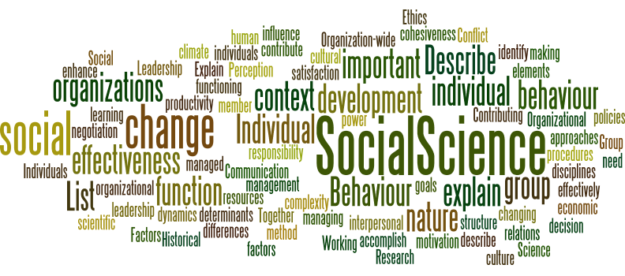

--- 
title: "Stanford Spring 2025 Intro to Computational Social Science"
author: "Yuze Sui"
date: "2025-03-31"
site: bookdown::bookdown_site
documentclass: book
---

# About {-}

*Figure Source: Katie Pacyna*

With an ever-growing amount of data collected on our online and offline behaviors—from our purchasing habits to our social interactions—we now have the unprecedented opportunity to study social life with remarkable precision. This hands-on course explores the promises and pitfalls of leveraging "big data" and algorithms to understand modern social and economic systems. Each week, we will examine key sociological topics such as inequality, discrimination, and polarization through the lens of computational methods, as well as delve into cutting-edge techniques in computational social science. The course culminates in a group research project that will equip you with skills ranging from designing and executing large-scale surveys and experiments to fitting machine learning models and analyzing diverse data types like social networks and natural language. No prior statistical or programming experience is required.

This website is the place where you can find R progamming lab notes for the course. 
